> By fully enabling concurrent multiple blocks execution with arbitrary expert numbers (MAX_EXPERT_NUMBER==256), and with aggresive usage of shared memory (5kB LDS) and registers (52 VGPRs, 48 SGPRs), the MoE Align & Sort logics was crafted to achieve 📈3x in A100🎉, 📈3x in H200🎉, 📈10x in MI100🎉, and 📈7x in MI300X/Mi300A🎉: ...

Author : [LEI WANG](https://github.com/yiakwy-xpu-ml-framework-team) (yiak.wy@gmail.com)

## Efficient MoE Align & Sort design in SGLang Fused MoE

MoE model mimics low power consumption pattern in human brain : functions are divided into divisions, partial activated via adaptive routing when thinking. 

<br />

<figure>
<p align="center">
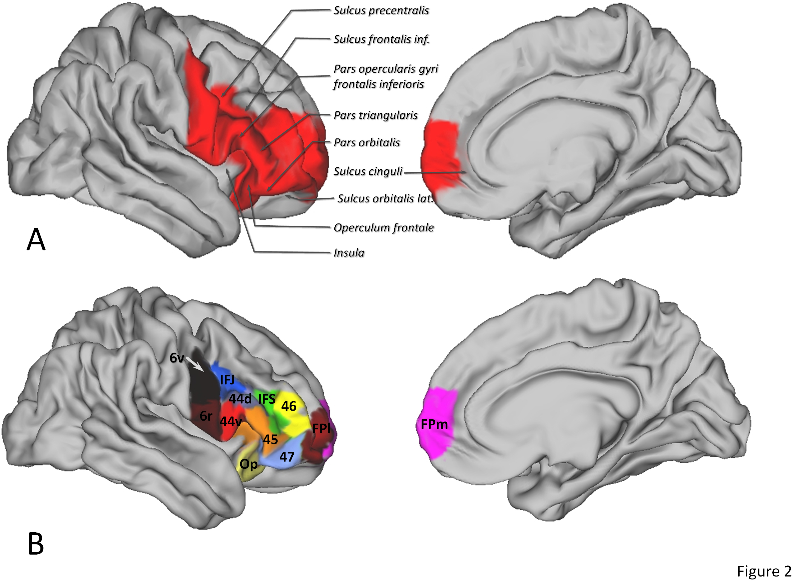
</p>
<figcaption style="text-align:center">human-brain cortex from Oxford university research paper, archived from internet</figcaption>
</figure>

<br />

The first truely workable version in CUDA is SwitchTransformer[1], then improved by Mistral[2] by upcycling dense models:

<br />

<figure>
<p align="center">
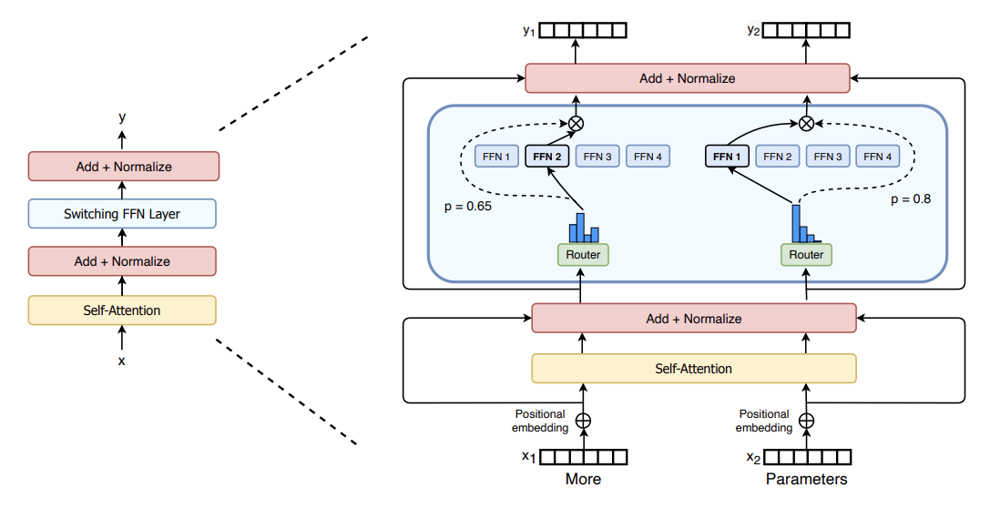
</p>
<figcaption style="text-align:center">switchTransformer-moe</figcaption>
</figure>

<br />

Later DeepSeek V2/V3/R1 [3][4][5] improved MoE by introducing shared experts [3] and gating bias [4][5], which finally leads to auxiliar loss free MoE models [4][5]. This is essentially attributed to the fact that when shared experts (chosen as 1 by deepseek team) are used, imbalance of experts routing problem can be mitigated by forcing a punishment of a bias score over a large pool of experts (256)[11].

<br />

The MoE layer is implemented as multi experts FFN layers, which consists gating functions to route activations according to topk gating scores (with bias in DeepSeek V3/R1), and producing logits by Group GEMM upon selected FFN layers.

<br />

The function relies heavily on radix sorting logics underlying. With MoE Align & Sort, ML researchers and practitioners can sort tokens in the order of expert IDs. 

<br />

In some application, such as **TransformerEngine** [6][7], the operation was implemented by deprecated **cub::DeviceRadixSort**, and **permute** was implemented to record the **src(left)** to **dest(right)** mapping, the gradient of which is **unpermuate**.

<br />

<figure>
<p align="center">

</p>
<figcaption style="text-align:center">MoE permute illustration</figcaption>
</figure>

<br />


Despite the fact that **cub::DeviceRadixSort** uses intensively shared memory, which is slighly slower than the implementation based on **__shfl_xor_sync** where only thread local memory is used, it does not allow **alignment sorting**. 

<br />

Alignment sorting is important for Group Gemm efficiency where experts can process tokens in blocks.

<br />

The MoE Align & Sort algorithm in SGLang employed **alignment sorting**, yet was not efficient when serving large scale prefill operations for MoE models up to 256 experts. The issue was identified in the [issue#2732](https://github.com/sgl-project/sglang/issues/2732). The current implementation split MoE Align & Sort into two kernel launches : 

<br />

- alignment : to conduct traditional alignment based offsets computation for the radix sorting algorithm within **a single block**;

- placement : to place tokens according to the offsets computed in **multiple blocks**;

<br />

We propose and write AMD-friendly CUDA kernels using our proposed MoE Align & Sort algorithm. So profiling and analysis on AMD platform will be fully considered.

<br />

By using **RocProfiler-Compute** for different workloads, we can clearly see that the first kernel takes **33W** cycles and second kernel takes **8W** cycles even without counting multiple kernels launch overhead in a trace profile :

<br />

<figure>
<p align="center">
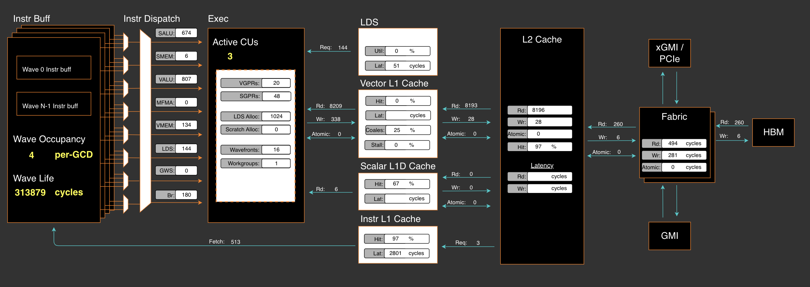
</p>
<figcaption style="text-align:center">the moe align kernel 1</figcaption>
<p align="center">
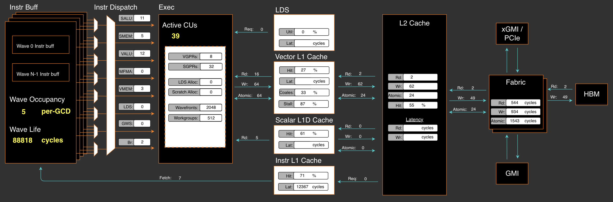
</p>
<figcaption style="text-align:center">the moe align kernel 2</figcaption>
</figure>

<br />

In ROCm SDK 6.3.0, omniperf has been rebranded as **rocprof-compute**. Dispite the active support of MI300X/MI300A, it is not by default shipped with ROCm SDK **6.3.0**. But setting up the ROCm compute profiler is nothing more than three simple steps as demonstrated in [Tools-dockerhub](https://github.com/yiakwy-xpu-ml-framework-team/Tools-dockerhub).

<br />

Now, on chip overhead will be immedately reduced to **20W** cycles from previous **41W** cycles after applying the [optimization we proposed](https://github.com/yiakwy-xpu-ml-framework-team/AMD-sglang-benchmark-fork/blob/790a832385a02d5f52ad627af333ca1c992e24de/sgl-kernel/src/sgl-kernel/csrc/moe_align_kernel.cu#L233) in [PR#3613](https://github.com/sgl-project/sglang/pull/3613):

<br />

<figure>
<p align="center">
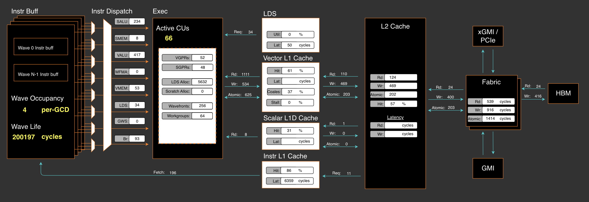
</p>
<figcaption style="text-align:center">enable efficient multi-blocks moe-align execution in SGLang</figcaption>
</figure>

<br />

By fully enabling concurrent multiple blocks execution with arbitrary expert numbers (MAX_EXPERT_NUMBER==256), and with aggresive usage of shared memory (5kB LDS) and registers (52 VGPRs, 48 SGPRs), the MoE Align & Sort logics was crafted to achieve [📈3x in A100🎉](#a100_bench), [📈3x in H200🎉](#h200_bench), [📈10x in MI100🎉](#mi100_bench), and [📈7x in MI300X/Mi300A🎉](#mi300_bench):

<br />

|    opt bench (all cases)    |  opt bench (snapshot) | GPU
:----------------------------:|:---------------------:|:-----:
 |  | A100
 |  | MI100 (gfx908)

<br />

With **Rocprof-Compute**, we can easily collect some key indictors for a captured kernel and visualize them in a remote GUI server:

<br />

<figure>
<p align="center">
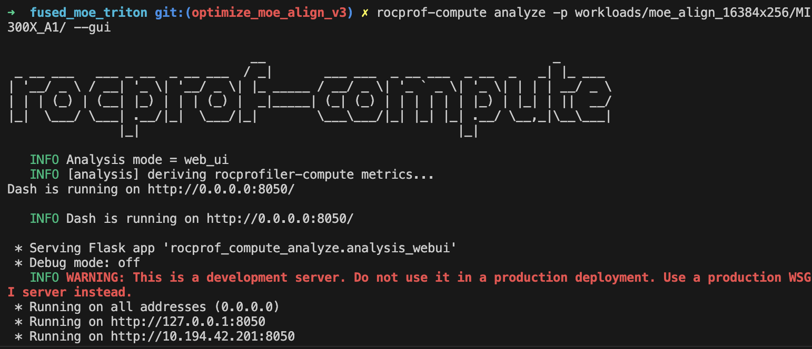
</p>
<figcaption style="text-align:center">Start Rocprof-Compute in server side</figcaption>
</figure>

<br />

To summary, in AMD MI300X/MI300A, the proposed efficient multi-blocks MoE Align & Sort algorithm uses aggressively both vector regsiters (52) per wave with no registers spills (I adjust the initial threads block size to its best), and LDS (5kB) per CU with only 6.8% bank conflicts rates.

<br />

We also analyzed the roofline model of MoE Sort & Align. The roofline model shows the kernel performance drops in memory bound region. 

<br />

In section [AMD Compute Profile](#amd_compute_profile), we gives details of the profiling data and analysis of our algorithm design in ROCm platform. 

<br />

Essentially, MI300X/MI300A is the world's first high-performance AI accelerator architecture based on a multi-die design. As a result, finetuning of operations on this chip will be slightly different from those on NVIDIA's platform.

<br />

The fundamental rule is, that synchronization among XCDs (Accelerated Computing Dies) is costly, better to make full use of XCDs and L2 cache locality affinity to increase the performance. 


<br />

And we should avoid expensive synchronization by either using **the lowest speed computing die** (XCD7 for MI300X, XCD5 for MI300A) when grid size is smaller than the number of XCDs per chip (8 for MI300X, 6 for MI300A), or adapting grid size to a multiple of the number of XCDs per chip when it exceeds that threshold.

<br />

Launching cooperative kernels by **hipCooperativeLaunch** may increase L2 cache pressure (relate to texture addresser stall rate and busy rate) when data exchange (espeically Die-Die Exchange) increases among blocks.

<br />

In this example, the implementation from previous **main** branch uses **39** active CUs which is **almost good** since essentially two dies were used.

<br />

Our implementation uses 66 active CUs in multi-blocks excution that acrossing two dies and Die-Die exchange is inevitable in block-wise reduction. We will submit further V4 optimization to SGLang later in this quarter.

<br />

Details will be further discussed in profiling section.

## Review of Fused MoE in SGLang

SGLang team used triton first approach to implement the logics and gained great successes in day 0 support of DeepSeek V3 in Dec 2024.

<br />

The SGLang [MoE](https://github.com/sgl-project/sglang/blob/8baf9a0c18c6bc700e89ad6deb200739a8242e09/python/sglang/srt/layers/moe/fused_moe_triton/fused_moe.py#L952) launches [fused MoE kernel](https://github.com/sgl-project/sglang/blob/8baf9a0c18c6bc700e89ad6deb200739a8242e09/python/sglang/srt/layers/moe/fused_moe_triton/fused_moe.py#L56) implemented in triton.

<br />

Before the kernel launch, the MoE Align & Sort algorithm is applied. the MoE Align & Sort triton kernel is splitted into 4 phases where direct accesses to DRAM without shared memory are employed contrast to the [vectorize triton version](https://github.com/sgl-project/sglang/pull/2913).

<br />

Multiple launches and inefficient use of LDS, local caches, and registers (VGPR for example) contributed to inefficient single test execution for small workloads, compared to single block CUDA implementation counterpart.

<br />

Then CUDA implementation is finally splitted into two phases and only the second phase execution is accelerated in multiple blocks.

## MoE Align & Sort CUDA Algorithm in other Open Source Platform

#### FasterTransfomer

Before Mistral[2] and DeepSeek V2[3], open dense models are more popular in inference scenarios. This was when **FasterTransfomer**[8] was born.

<br />

In **FasterTransformer**[8] project, initiated by NVIDIA, MoE models are supported essentailly via **cub::DeviceRadixSort** and kernels like **moe_softmax** (which is essentially softmax in **cub::BlockReduce**), **moe_top_k** and its fused version **topk_gating_softmax**, **permute** to order latent vector logits, and finally [group gemm](https://github.com/NVIDIA/FasterTransformer/blob/df4a7534860137e060e18d2ebf019906120ea204/src/fastertransformer/kernels/moe_kernels.cu#L622). 

<br />

Hence fusion is largely (by cost) limited to topk gating softmax, biased topk gating softmax, which are later incoroperated in SGLang.

#### Megatron

Megatron, before the publication of this article, for FP16/BF16, largely uses **FasterTransformer** approach but added gradient operation of **permute** : **unpermute**, to facilitate [training workload](https://github.com/fanshiqing/grouped_gemm).

<br />

That means MoE is also not efficiently fused.

#### vLLM

SGLang uses many vLLM kernels, but vLLM 's Fused Moe was initially contributed by SGLang team. Hence they deploy the same approach.

#### CK

The first version of AMD friendly fused MoE was proposed in [CK#1634](https://github.com/ROCm/composable_kernel/pull/1634) in NOV 26, 2024. Later, MoE Align & Sort was added in [CK#1771](https://github.com/ROCm/composable_kernel/pull/1771) and [CK#1840](https://github.com/ROCm/composable_kernel/pull/1840).

<br />

The high level idea is to fuse MoE sorting with Group GEMM. And MoE & Sorting in CK largely employes SGLang's team approach execept for CK pipliner and partitioner.

<br />

<figure>
<p align="center">
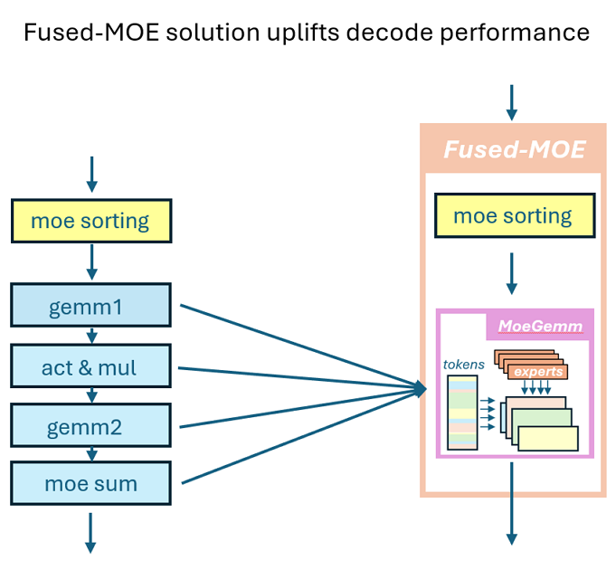
</p>
<figcaption style="text-align:center">CK fused MoE High Level Idea[9]</figcaption>
</figure>

<br />

Fusion of **per_group_token_quant** (for online fp8 quantization), **MoE sorting** and **Group GEMM** can be immediately resolved by incorporating Radix Sort computing logics into Group GEMM pipeliner: count occurencies to compute offsets followed by parallel placement.

<br />

One of the most critical problems is that how the two kinds of workloads (Radix Sorting & Group GEMM) is balanced. 

<br />

In AMD data center chips, Group GEMM fragment is more likely to be evenly distributed to all the available blocks in an XCD. While, the data exchange among blocks in different CUs are through low speed of L2 Cache and L2 Cache fabric if multiple XCDs involved. 

<br />

Writing CK kernels requires writing host side CK solution launcher:

```
    // Here is the entry of fused MoE : 
    //   https://github.com/ROCm/composable_kernel/blob/1342ecf7fbf64f43d8621cf6665c583fdc49b2c6/example/ck_tile/15_fused_moe/instances/fused_moegemm_api_internal.hpp
    using f_pipeline    = ck_tile::FusedMoeGemmPipeline_FlatmmUk<f_problem>;
    using f_partitioner = ck_tile::FusedMoeGemmTilePartitioner_Linear<f_shape>;
    using f_kernel      = ck_tile::FusedMoeGemmKernel<f_partitioner, f_pipeline, void>;

    const dim3 grids                       = f_kernel::GridSize(a);
    constexpr dim3 blocks                  = f_kernel::BlockSize();
    constexpr ck_tile::index_t kBlockPerCu = 1;

    static int printed = 0;

    auto kargs = f_kernel::MakeKargs(a);
    if(s.log_level_ > 0 && printed == 0)
    {
        std::cout << ", " << f_kernel::GetName() << std::flush;
        printed = 1;
    }

    return ck_tile::launch_kernel(
        s, ck_tile::make_kernel<blocks.x, kBlockPerCu>(f_kernel{}, grids, blocks, 0, kargs));
```

, [device entry of the kernel](https://github.com/ROCm/composable_kernel/blob/1342ecf7fbf64f43d8621cf6665c583fdc49b2c6/include/ck_tile/ops/fused_moe/kernel/fused_moegemm_kernel.hpp#L238), tile partitioner, and stages pipliner.

<br />

The AMD CK partitioner and stages pipliner for fused moe is also very interesting to be attributed to the final assembly, yet out of scope of this article.

<br />

But just remember its MoE Align & Sort is part of producer codes :

```
// https://github.com/ROCm/composable_kernel/blame/fdaff5603ebae7f8eddd070fcc02941d84f20538/include/ck_tile/ops/fused_moe/kernel/moe_sorting_kernel.hpp#L438
CK_TILE_DEVICE void moe_align_block_size_kernel(...) 
{
        const index_t tid       = static_cast<index_t>(threadIdx.x);
        const index_t start_idx = tid * tokens_per_thread;
...
#if 1
        if(tid < num_experts){ // each thread reduce a column segment of tokens_cnts with # blockDim.x elements
          ...
        }
#else
...
#endif
        __syncthreads();

        // do cumsum to compute offsets based on condition

        // do parallel placement based on the offsets computed

}
```

<br />

So MoE Align & Sort in the AMD CK solution alomost aligns with SGLang main implementation execept for partitioner and pipliner. 

<br />

Note the implementation does not always promises the best performance in AMD platform (see asm MoE in AITER).

<br />

Since AMD CDNA3 arch does not support **Graphcore** alike on-chip shuffling (we abstracted and generalized on-chip shuffling as **Remapping** Op of PopART[12] & PopRT in 2023) magics, -- which was now supported in NVIDIA H100/H200/B200 throughout high efficient on chip **SM<->SM** communication.

<br />

As a result, adapting the data layout cheaply among blocks to its best will be a very intersting section in AMD's open source solution.

<br />

Hence, in philosophy, tiling based fusion code of these two different workloads may not always exceed the non-fused version. Details of the research will be conducted in our V4 release.

<br />

#### AITER

<br />

<figure>
<p align="center">
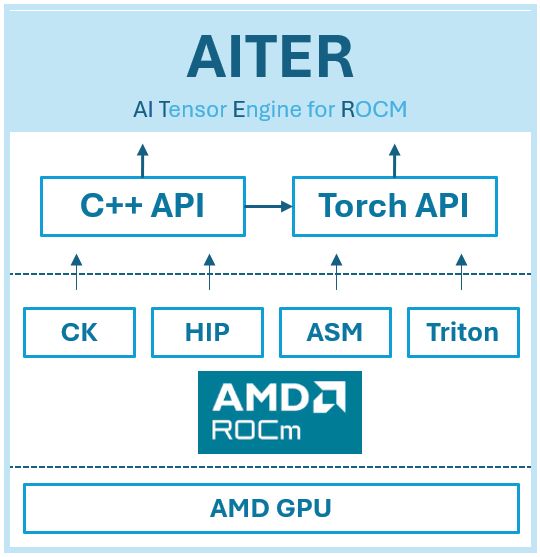
</p>
<figcaption style="text-align:center">AI Tensor Engine For ROCm[10]</figcaption>
</figure>

<br />

AITER was introduced at an early time of this year to incorporate LLM kernels used in different projects. It supports Fused MoE via [ck moe](https://github.com/ROCm/aiter/pull/95), [asm version of MoE via hipModule](https://github.com/ROCm/aiter/blob/52085276ad4710e1a0c9ce2f62ca177a2af35ffa/csrc/py_itfs_cu/asm_fmoe.cpp#L69) and triton fused moe. 

<br />

Hence it is partially open source, since the opaque assembly and development schedule to MI300X developers. 

<br />

The aleged 3x acceleration [10] of fused MoE in AITER is verified by Bruce Xu [13] and is essentail from the acceleration observed in a group GEMM with different shapes : a gemm where each expert's FFN weights mutliply a block of hidden states of tokens.

The proof is that asm gemm generates almost 3x improvements in [PR#199](https://github.com/ROCm/aiter/pull/199):

<br />

<figure>
<p align="center">

</p>
<figcaption style="text-align:center">ASM Flat Matrix Multiply</figcaption>
</figure>

<br />

Notablly, there are still cases where triton kernels adapted from SGLang community are selected. To run triton kernel efficiently on MI300X/MI300A, they map thread blocks onto dies using multi-die architecture specific logics :

```
    # https://github.com/ROCm/triton/blob/f669d3038f4c03ee7a60835e875937c65b5cec35/python/perf-kernels/gemm.py#L115
    ...
    ## pid remapping on xcds
    # Number of pids per XCD in the new arrangement
    pids_per_xcd = (GRID_MN + NUM_XCDS - 1) // NUM_XCDS
    # When GRID_MN cannot divide NUM_XCDS, some xcds will have
    # pids_per_xcd pids, the other will have pids_per_xcd - 1 pids.
    # We calculate the number of xcds that have pids_per_xcd pids as
    # tall_xcds
    tall_xcds = GRID_MN % NUM_XCDS
    tall_xcds = NUM_XCDS if tall_xcds == 0 else tall_xcds
    # Compute current XCD and local pid within the XCD
    xcd = pid % NUM_XCDS
    local_pid = pid // NUM_XCDS
    # Calculate new pid based on the new grouping
    # Note that we need to consider the following two cases:
    # 1. the current pid is on a tall xcd
    # 2. the current pid is on a short xcd
    if xcd < tall_xcds:
        pid = xcd * pids_per_xcd + local_pid
    else:
        pid = tall_xcds * pids_per_xcd + (xcd - tall_xcds) * (pids_per_xcd - 1) + local_pid

    if GROUP_SIZE_M == 1:
        pid_m = pid // num_pid_n
        pid_n = pid % num_pid_n
    else:
        num_pid_in_group = GROUP_SIZE_M * num_pid_n
        group_id = pid // num_pid_in_group
        first_pid_m = group_id * GROUP_SIZE_M
        group_size_m = min(num_pid_m - first_pid_m, GROUP_SIZE_M)
        pid_m = first_pid_m + (pid % group_size_m)
        pid_n = (pid % num_pid_in_group) // group_size_m
    
    ...
```

Besides, various of AMD chip intrinsics have been used in CK fused MoE, such as 

- **__builtin_nontemporal_load**, 

- **__builtin_amdgcn_ds_swizzle**, 

- **__builtin_amdgcn_ds_permute**/**__builtin_amdgcn_ds_bpermute**, 

- **_builtin_amdgcn_mov_dpp** 

and so on so forth. These are suspected to be attributed to the final assembly version of fused MoE. 

<br />

For example, with usage of **__builtin_nontemporal_load**, we can skip L2 cache and leave more spaces in L2 cacheline for the data predicted to be resued.

#### Cutlass v3.8

Fused MoE is not currently publicly supported in NVIDIA Cutlass 3.8.0 at the time I am writing this article. Hence no MoE Align & Sort available this repo.

#### TRT-LLM

Before v0.16.0, the TRT-LLM basic follows **FasterTransformer** approach. After v0.17.0, the MoE part is disclosed.

## Make AMD Friendly CUDA Implementation wtih more than 3x ~ 7x acceleration

The algorithm employes multiple blocks execution schemes and consists of 3 different sections (D-C-P) : 

- Distributed concurrencies counting
- Computing cumsum
  - parallel unaligned local cumsum
  - reduce unaligned cumsum
  - align global cumsum
  - store global cumsum
- Parallel placement

<br />

<figure>
<p align="center">
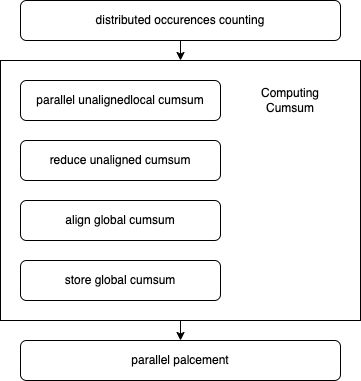
</p>
<figcaption style="text-align:center">Our proposed efficent multi-blocks MoE Align & Sort algorithm</figcaption>
</figure>

<br />

#### Parallel unaligned local cumsum

<br />

<figure>
<p align="center">
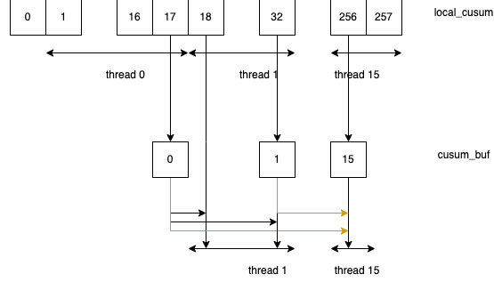
</p>
<figcaption style="text-align:center">Our proposed parallel local unaligned cumsum</figcaption>
</figure>

<br />

The algorithm was first proposed and implemented by us in [PR#2970](https://github.com/sgl-project/sglang/pull/2970).

<br />

We load balanced the cumsum execution in each block to **kElementsPerThr(16)** threads, where **kElementsPerThr + kElementsPerThr + threadIdx.x** Add Operations needed to be processed in each thread. 

<br />

Hence wavefront is faster to reach compared to the single thread version in current repo and we hereby observed **30%** improvement in this version of implementation.

#### Reduce unaligned cumsum

Once we get local unligned cumsum in each block, we proceed to block-wise reduction among the cumsum stored in the pre-allocated HBM buffer. 

<br />

We choosed **FRAG_SIZE_M(16) x FRAG_SIZE_N(16) x FRAGS_PER_BLOCK(4)** SRAM fragments for block-wise reduction, and **FRAGS_PER_BLOCK** is tunable :

<br />

<figure>
<p align="center">
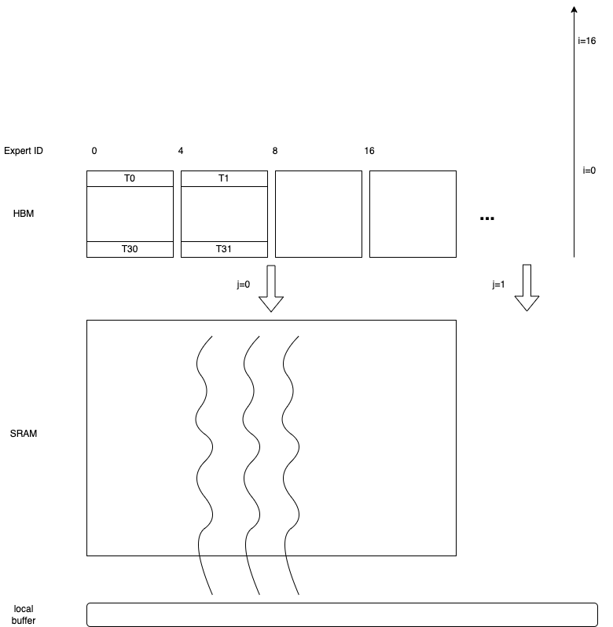
</p>
<figcaption style="text-align:center">Block-Wise Reduction</figcaption>
</figure>

<br />

In AMD platform, calculation is performend on a 1 warp to load / 1 warp to compute basis, while 2 warps to load and 1 warp to compute in NVIDIA platform. 

<br />

The design makes use of full advantages of AMD 64 SIMD lanes in CDNA3 architecture. And the number blocks is always multiple of the number of XCDs in this multi-die arch chip.

<br />

FRAGS_PER_BLOCK was set to 4 to facilitate re-use of SMEM in multiple rounds.

<br />

#### Align global cumsum & store global cumsum

We improved the vectorization codes and take care of loop tails if input data size is not aligned with **kElementsPerAccess** constant.

The benchmarks show coalescing rate is improvmed but still limited to **30%**. We will work on it in V4 release. 

#### Writing AMD friendly CUDA

Writing a pytorch extension enables automatic tranlating CUDA kernel to HIP kernel with ROCm SDK. 

However there are cases where the HIP kernel works differently from CUDA kernel :

- Warp size is a architecture dependent global variable and defined in ROCm SDK as **warpSize**; in CDNA3 arch, **warpSize** is defined **64**

- The device function signature may not perfectly aligned with CUDA, and needs conditional compiling to support these symbols

- Being aware of L2 cache optimization in multi-die chips arch

## Benchmarks

We conducted extensive tests without under CUDA graph capture for large workloads of deepseek v3 models. Hence the number of experts was set to 256. The algorithm currently does not support to be under cuda graph capture and we will resolve this issue later in V4 release.

<br />

Due to the virtualizaton of GPU machines and the number of CPU allocated for the test node, the performance may vary from time to time compared to bare metal tests. 

<br />

Hence we use triton implementation as baseline to demonstrate the acceleration multiple and efficiency of our proposed algorithm for MoE Align & Sort.

<br />

Each test was verifed first before benchmark. During the benchmark, we observed that triton in AMD platform runs signifcantly longer than that in NV at the time we tested. We hence recommend further optimization of triton MLIR for more efficient lowering process compared to NVDIA triton.

<br />

For AMD triton, we observed MI300X is 1.5x more faster, hence improvement multiple in MI300X is not significant as MI100. And morover, even MI300X is generally believe more faster than MI100, but in our test, the algorithm in MI100 performs better than in MI300X.

It is partially attributed to the fact that for a memory bounded op, the communication among multiple dies chip lowering the speed of execution.

<br />

In the both platforms we observed significant improvements after applying our proposed algoirthm, where the exsting cuda implementaion almost costed the same time as Triton.

#### AMD system preparation

In order to make best usage of AMD heteogenous system, it is recmmend to do some checking. 

- Both NVIDIA Grace CPU and AMD EPYC 9004 system are generally recommended disable NUMA auto balancing to work with GPU; hower there are cases where it is [not](https://rocm.docs.amd.com/en/latest/how-to/system-optimization/mi300x.html#)

- When virtualizaton enabled, IOMMU pass-through mode is recommended to elimnitate DMA translation, hence to bring performance improvements

<div id="mi100_bench"></div>

#### Benchmark on MI100

> git clone https://github.com/yiakwy-xpu-ml-framework-team/AMD-sglang-benchmark-fork.git -b optimize_moe_align_v3 && cd sgl-kernel && python setup_rocm.py install

Feasibility across different combination of numbers input token and experts can be verified:

> cd ../benchmark/kernels/fused_moe_trition && python benchmark_deepseekv3_moe_align_blocks.py --verify


| num_tokens  | experts | SGLang    | Triton (AMD) | GPU  
:------------:|:-------:|:---------:|:------------:|------
8192          | 256     |   79.36   | 426.71       | MI100
16384         | 256     |   86.4    | 681.12       | MI100
16384 x 128   | 256     |   3047.68 | 62442.85     | MI100
32768 x 128   | 256     |   7211.37 | 129388.43    | MI100


<div id="a100_bench"></div>

#### Benchmark on A100


| num_tokens  | experts | SGLang     | Triton (NV) | GPU  
:------------:|:-------:|:---------:|:------------:|------
8192          | 256     |   77.44    | 124.92      | A100
16384         | 256     |   \        | \           | A100
16384 x 128   | 256     |   5966.81  | 17396.51    | A100
32768 x 128   | 256     |   12450.05 | 34711.14    | A100


<div id="h200_bench"></div>

#### Benchmark on H200

| num_tokens  | experts | SGLang     | Triton (NV) | GPU  
:------------:|:-------:|:---------:|:------------:|------
8192          | 256     |   \        | \           | H200
16384         | 256     |   \        | \           | H200
16384 x 128   | 256     |   4508.42  | 12361.15    | H200
32768 x 128   | 256     |   9023.48  | 24683.70    | H200


<div id="mi300_bench"></div>

#### Benchmark on MI300X

| num_tokens  | experts | SGLang     | Triton (AMD) | GPU  
:------------:|:-------:|:----------:|:-----------:|------
8192          | 256     |   88.16    | 281.64      | MI300X
16384         | 256     |   134.02   | 448.88      | MI300X
16384 x 128   | 256     |   6865.64  | 43266.09    | MI300X
32768 x 128   | 256     |   13431.80 | 89788.58    | MI300X

<div id="amd-compute-profile"></div>

## AMD Compute Profile

#### Setup

In ROCm 6.3.3, setup a **rocprof-compute** can be easily as three steps setup, details can be found here : https://github.com/yiakwy-xpu-ml-framework-team/Tools-dockerhub/tree/main


#### Profiling Results of Vector L1 Cache

The workload **16384** tokens x (top **8** out of **256** experts) unless otherwise specified.

| kernel                                              | VGPRs | SGPRs| active CUs | Vector L1 cache hit rate | coalescing rate / utils
:----------------------------------------------------:|:-----:|:----:|:----------:|:------------------------:|-----
[old main](https://github.com/sgl-project/sglang/blob/fb8886037c32138e418cfc333baaef43b1e1f68b/sgl-kernel/csrc/moe/moe_align_kernel.cu#L44) moe_align_block_size_kernel (k1)        | 20    | 48   | 3          | 0%                       | 25% / 7%
[old main](https://github.com/sgl-project/sglang/blob/fb8886037c32138e418cfc333baaef43b1e1f68b/sgl-kernel/csrc/moe/moe_align_kernel.cu#L28) count_and_sort_expert_tokens_kernel (k2)| 8     | 32   | 39         | 27%                      | NaN
[our](https://github.com/yiakwy-xpu-ml-framework-team/AMD-sglang-benchmark-fork/blob/790a832385a02d5f52ad627af333ca1c992e24de/sgl-kernel/src/sgl-kernel/csrc/moe_align_kernel.cu#L233) moe_align_block_size_kernel                  | 52    | 48   | 66         | 61%                      | 36% / 18%

We maximize the usage of VGPRs but reduce total usage of SGPRs in our algorithm. The data also indicates Zero VGPRs/SGPRs spills usage that healthy usage of registers and no performance panelty for this kernel. 

<br />

Vector L1 cache (vL1D) is unit local to each CU, the hit rate records cache line hit rates when data requestd from L2 Cache to CU. **30%** L2 cache requests was coalesced by vL1D's texture addresser and **61%** hit rates achieved, which can also be improved later if necessary.

<br />

At the time data requested from CU to vL1D's addressing processing unit (texture addresser), there are four states for the complex to decide whether to accept or roll back the data request to CU via the data processor unit in vL1D.

<br />

- Busy : the texture addresser is processing address

- Address Stall : the texture addresser is stalled from sending address to vL1D

- Data Sending Stall : the texture addresser is stalled from sending data to vL1D

- Data Waiting Stall : the texture addresser is stalled waiting to send data to data processor unit in vL1D

<br />

Detials of this micro arch behavior can be found in AMD CDNA3 ISA and [rocProfiler-compute docs](https://rocm.docs.amd.com/projects/rocprofiler-compute/en/latest/conceptual/vector-l1-cache.html#desc-td). 

<br />

<figure>
<p align="center">
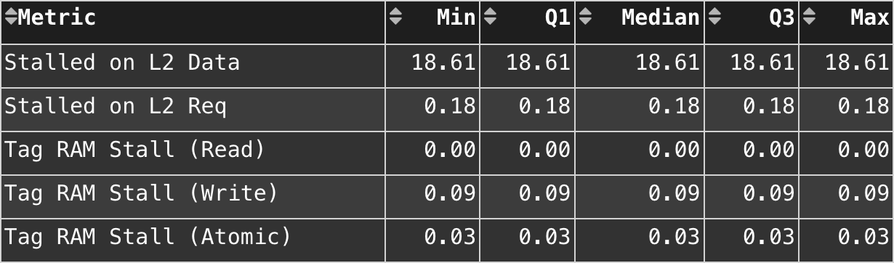
</p>
<figcaption style="text-align:center">ours vL1D addresser stall</figcaption>
</figure>

<br />

We witnessed 18.61% Data Waiting Stall rate from vector L1 cache in this aglorithm design.

<br />

The load balance of data R/W is greatly reduced from **8 kB** Reading Op, **27 B** Writing Op to combination of **109 B** Reading Op, **468 B** Writing Op and **202 B** Atomic Op.

##### Profiling Results of L2 Cache

In CDNA3 architecture, L2 Cache is shared by all CUs and is the main entry to share data among thread blocks distruted to different CUs. 

<br />

With multiple channels and addresses interleaving design, requests to L2 cache can be largely handled concurrently.

<br />

Morover with AMD specific intrincs such as **__builtin_nontemporal_load**, we can pass through L2 cache for data we don't need to visit again.

<br />

The details of L2 cache study will be revealed in V4 release.

## Conclusion

The new algorithm accelerates MoE Align & Sort in both CUDA and ROCm platform significantly up to 3x ~ 7x by maximizing the usage of LDS and vector registers. 

<br />

We also observed memory bounded op may perform worse in a multiple die chip compared to a single die chip, this indicates a new finetuning direction when programming device codes in a multiple-die chip such as MI300X/MI300A and B200/B300.

<br />

However, details of the algorithm can be still polished to improve cache hit rate and main memory coalecsing rate. 

## Acknowledgement

Special thanks to Prof Zhang Han (hanzhangqin8@gmail.com), Doctor Wang YunHong (yunhongwang2000@gmail.com) from NUS team for the collabration in MI100/MI250 performance verification, Zev Rekhter (Connect@reishi.ai) for the collabration in MI300X performance verification, Shuyi Fan (fsygd1996@163.com) for the collabration in H200 verification and [BBuf](https://github.com/BBuf)(1182563586@qq.com) for discussion and review of the solution in the SGLang.

Note this is an independent work from SGLang community. 

I also express my deep thanks to Bingqing, Peng Sun and ShawHai who spare time individually in reviewing the article and giving suggestions in revision. 

## Reference

1. W. Fedus, B. Zoph, and N. Shazeer. Switch transformers: Scaling to trillion parameter models
with simple and efficient sparsity. CoRR, abs/2101.03961, 2021. URL https://arxiv.org/
abs/2101.03961.
2. A. Q. Jiang, A. Sablayrolles, A. Mensch, C. Bamford, D. S. Chaplot, D. d. l. Casas, F. Bressand,
G. Lengyel, G. Lample, L. Saulnier, et al. Mistral 7b. arXiv preprint arXiv:2310.06825, 2023.
3. DeepSeek-AI. Deepseek-v2: A strong, economical, and efficient mixture-of-experts language
model. CoRR, abs/2405.04434, 2024c. URL https://doi.org/10.48550/arXiv.2405.04434.
4. DeepSeek V3 : https://arxiv.org/abs/2412.19437; Retrieved on 2025-03-18
5. DeepSeek R1 : https://arxiv.org/pdf/2501.12948; Retrieved on 2025-03-18
6. TransformerEngine : https://github.com/NVIDIA/TransformerEngine; Retrieved on 2025-03-18
7. NV Group GEMM : https://github.com/yiakwy-xpu-ml-framework-team/NV_grouped_gemm; Retrieved on 2025-03-18
8. FasterTransformer : https://github.com/NVIDIA/FasterTransformer; Retrieved on 2025-03-18
9. CK Fused MoE V1 : https://github.com/ROCm/composable_kernel/pull/1634
10. AMD 3X MOE : https://rocm.blogs.amd.com/artificial-intelligence/DeepSeekR1-Part2/README.html
11. Lean Wang and Huazuo Gao and Chenggang Zhao and Xu Sun and Damai Dai Auxiliary-Loss-Free Load Balancing Strategy for Mixture-of-Experts, 2024. URL https://arxiv.org/abs/2408.15664.
12. PopART on chip TensorRemap : https://github.com/graphcore/popart/tree/sdk-release-3.4
13. DeepSeek V3 Optimizatoin based on AITER backend : https://github.com/sgl-project/sglang/pull/4344

## Sponsor Sources

Also see [reishi.ai](https://reishi.ai/blog/Moe-align-and-sort) and [huggingface](https://huggingface.co/blog/yiakwy-xpu-team/efficient-moe-align-sort-design-for-sglang)