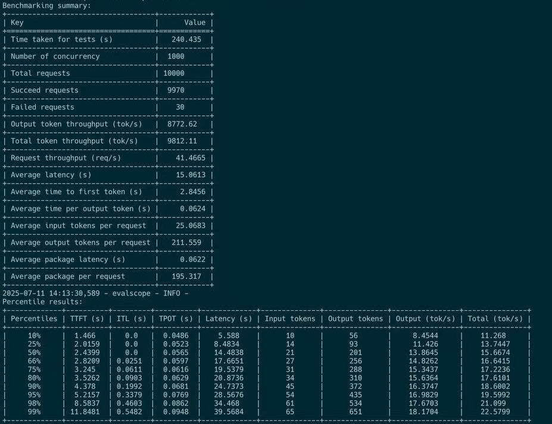

<style>
caption {
  caption-side: top;
  text-align: center;
  padding-bottom: 10px;
  font-weight: bold;
}
</style>

> We validated maximum prefill and decode disaggregated throughput for 13 x H800 DGX SuperPod at the speed of around 1.3 million toks/sec input throughput and 20 k toks/sec output throughput over various of disaggregation settings such as P4D9, P4D6. P2D4, P2D2 in server online test (benchmark with SGLang **bench_one_batch_server.py** [^1] to meausre URL API calling in server side), followed by user side online test under service level objectives (SLO) (benchmark with evalscope [^2] to measure OpenAI compatible URL API with API Key in an endpoint) at the speed of output throughput of 25k toks/sec at concurrencies of 50, 55k toks/sec at concurrencies of 150 for small queries. Given 1k, 2k, 4k input, when **batch size * input length** exceeds certainer number, TTFT grow suddenly and steeply, overall latency dominated by TTFT since transferring of KV cache takes major time. Balance between gpu utilization and goodput rate can be achieved if input sequnce length (few hundred MB * batch size / KV cache transfer speed) is bounded and much larger than output length, preferable 4:1 in H800 DGX SuperPod. High TTFT leads to unreliable output throughput and low goodput rate in server side online test.

Authors : [LEI WANG](https://github.com/yiakwy-xpu-ml-framework-team) (yiak.wy@gmail.com, Researcher and PhD candidate in HKUST)

## Motivation & Background

In Prefill-Decode aggregated LLM inference architecture, an interlevating schedule plan between prefill tokens and decodes tokens were implemented in vLLM bofore [2024 Q2](https://github.com/vllm-project/vllm/issues/3861), then improved with or continous scheduling [^3] for overall GPU utimizaton. However due to distinct computing natures of prefill and decode stages, continous batching of incoming requests of full un-chunked prefill tokens with decode tokens of running requests increase significantly decode latency, hence large ITL are expected. Chunk-prefill feature [^4] in [PR#3130](https://github.com/vllm-project/vllm/issues/3130) has been implemented so that chunked prefill tokens of incomping requests and decode tokens of runing requests are batched together in a colocated system as demonstrated below for better ITL and GPU utilization:

<br />

<figure>
<p align="center">

</p>
<figcaption style="text-align:center">chunked-prefill schedule in aggregated serving architecture</figcaption>
</figure>

<br />

However chunk-prefill does take into account distinct computing natures of prefilling and decodeing. The process of decoding is often captured by a cuda graph for multiple rounds of generation, hence addtional overhead brought in when decoding is batched with chunked prefill and cuda graph is not viable. It is very likely to happen.

<br />

Moreover, as obsered by DistServe [^4] [^5] [^6] on 13 B dense model and our experiments on 671 B MoE model, cost of prefill increase significantly once `batch_size * output_length` exceeds a certain threashould (i.e. 128 * 128) for a colocated serving system, no matter what chunk-fill size set.

<br />

We conducted both aggregated and disaggregated serving expriments at scales with our own finetuned DeepSeek V3 (0324) alike model in SGLang v0.4.8.

<br />

Given an input length (in_seq_len : 128 ~ 4096) and short output length (out_seq_len : 1~256), tuning over different batch sizes (bs), we concluded that maximum of prefill goodput in seving DeepSeek V3 alike massive MoE model, arrives at specific `batch size (bs) x output length (out_seq_len)` in an aggregated LLM inference architecture, and arrives at specific `batch size (bs) * input length (in_seq_len)` in a disaggregated LLM inference architecture.

<br />

Unlike serving 13 `B` dense model in DistServe [^4] [^5] [^6] , prefill goodput in serving 671 `B` large MoE (8 out of 256 experts, plus `$P * 8` redundant experts), is negatively affected by the output length and batch sizes once its max is achieved. The details of statistics can be found in Appendix.

#### Review of Prefill decode nodes Colocated H800 X 2 test

In a H800 x 2 (DGX SuperPod) test config, each node is connected via infiniband, the max of input Tput arrives at 20 k toks/sec :

<figure>
<p align="center">

</p>
<figcaption style="text-align:center">aggregated input tput achieve max at specific batch_size x otuput_length</figcaption>
</figure>

<br />

When `batch size x output length` exeeds `128x128`, we see input tput drops significantly with sudden and steep growth of TTFT, while output tput increase gradually as batch size incrase to reach its max.

<br />

<figure>
<p align="center">

</p>
<figcaption style="text-align:center">input tput and ttft</figcaption>
</figure>

<br />

All of these statistics indicate that maximum of prefill and decodes throughput generates different workloads.

<br />

Intuitively, in disaggregated serving architecture, goodput (throughput under SLO, i.e., TTFT < 2s, ITL < 50ms) of prefill nodes with suitable chunk-prefill size, is bounded certain batch size, since KV cache transfer speed is fixed.

## Benchmarking Method

Investigating over all feasible disaggregation configs with 13 x H800 DGX SupperPod machines, and diving into SGLang (v4.8.0) disaggregation mode, we conducted online P/D disaggregation serving evalution both in server side and user side independently.

<br />

To prepare for the test, we first align our hardware and software with latest open source community, and followed instructions from SGLang team [^7] to prepare the configurationf files :

<br />

| name                            | role           | example                                                                          |
| ------------------------------- | -------------- | -------------------------------------------------------------------------------- |
| EXPERT_DISTRIBUTION_PT_LOCATION | decode         | ./attachment_ep_statistics/decode_in1000out1000.json                             |
| EXPERT_DISTRIBUTION_PT_LOCATION | prefill        | ./attachment_ep_statistics/prefill_in1024.json                                   |
| DEEP_EP_CFG                     | prefill        | ./benchmark/kernels/deepep/deepep_nnodes_H800x4_tuned.json                       |
| fused_moe_config                | prefill/decode | fused_moe/configs/E=257,N=256,device_name=NVIDIA_H800,block_shape=[128,128].json |

<br />

After obtaining the config files, and well preparing testing scripts, since we are using JIT kernel compilation services in SGLang, we warm up services with few queries batches with CURL API , then proceed to collect test stat.

This helps reduce bias of re-use of KV cache blocks and eliminiate JIT comppilation time from testing result.

#### Hardware & Software

The hardware of H800 SuperPod used in this experiment organized in racks :

<br />

<figure>
<p align="center">

</p>
<figcaption style="text-align:center">H800 SuperPod Sketch</figcaption>
</figure>

<br />


H800 DGX has almost equal computing abilities as H100 DGX, except for FP64/FP32 and almost half of communication bandwidth of H100 DGX machine. Each H800 is connected to 1 mellanox CX-7 (MT2910) NIC card. And each CX-7 NIC connects to infiniband switch, runs at maximum of 50 GB/s.

<br />

In a single node NCCL test, `nccl_all_reduce` runs at 213 GB/s bus bandwidth; In two nodes test, `nccl_all_reduce runs at 171 GB/s bus bandwidth.

<br />

Most of our communication functions in P/D disaggregation test runs DeepEP with NVSHMEM. DeepEP has changed a lot since the version used in May 2025 for P/D experiment by SGLang core team. So we build it from scatch inside customer docker:

<br />

> Deepep : deep-ep==1.1.0+c50f3d6

<br />

For the moment disaggregatin backend is set to mooncake, but we will try others later:

```
# optional for disaggregation option
disaggregation_opt=" \
  $disaggregation_opt \
  --disaggregation-transfer-backend mooncake \
"
```

> mooncake-transfer-engine==v0.3.4

The latest transfer engine is 10x faster ( see [PR#499](https://github.com/kvcache-ai/Mooncake/pull/499) and [PR#7236](https://github.com/sgl-project/sglang/pull/7236) ) than that was used in May 2025.

<br />

Tunning DeepEP is the first step in our test. Prefill nodes are 2 and 4 (3 prefill nodes are not possible in current configuration for SGLang v0.4.8) :

<br />

| Prefill GPU | dtype | dispatch (RDMA GB/s) | dispatch (NVL GB/s) | combine (RDMA GB/s) | combine (NVL GB/s) | loc                             |
| ----------- | ----- | -------------------- | ------------------- | ------------------- | ------------------ | ------------------------------- |
| 4           | bf16  | 60.58                | 121.63              | 56.72               | 113.88             | deepep_nnodes_H800x4_tuned.json |
| 2           | bf16  | 47.93                | 156.45              | 42.97               | 140.26             | deepep_nnodes_H800x2_tuned.json

<br />

In this experiment, DeepEP test shows that the performance for `bf16` is much higher than `OCP fp8e4m3`. We tried different combination of NCCL, NVSHMEM envrionment variables, only few succeeded due to compatible problems with libtorch:

<br />

```
# env - nccl
export NCCL_IB_HCA=mlx5_0,mlx5_3,mlx5_4,mlx5_5,mlx5_6,mlx5_9,mlx5_10,mlx5_11

# traffic class for QoS tunning
# export NCCL_IB_TC=136
# service level that maps virtual lane
# export NCCL_IB_SL=5

export NCCL_IB_GID_INDEX=3

export NCCL_SOCKET_IFNAME=ibp24s0,ibp41s0f0,ibp64s0,ibp79s0,ibp94s0,ibp154s0,ibp170s0f0,ibp192s0
# export NCCL_DEBUG=DEBUG

# export NCCL_IB_QPS_PER_CONNECTION=8
# export NCCL_IB_SPLIT_DATA_ON_QPS=1
# export NCCL_MIN_NCHANNELS=4

# NOTE Torch 2.7 has issues to support commented options


# env - nvshmem
# export NVSHMEM_ENABLE_NIC_PE_MAPPING=1
# export NVSHMEM_HCA_LIST=$NCCL_IB_HCA

# export NVSHMEM_IB_GID_INDEX=3

# NOTE Torch 2.7 has issues to support commented options, see Appendix
```
<br />

Successufl tuning should expect to see this:

<br />

<figure>
<p align="center">

</p>
<figcaption style="text-align:center">deepep test snapshot</figcaption>
</figure>

<br />

By default in SGLang v0.4.0, DeepGEMM is not in use, and there is no GEMM/group GEMM configs for fused MoE kernels running in H800, so we fine tuned fused MoE kerenl to generate H800 configs.

Due to the system memory limit in H800, depolyment unit for Prefill and Decode are carefully selected from :

<br />

|                   | Deploy Unit | TP       | E(D)P    |
| ----------------- | ----------- | -------- | -------- |
| H100 / H800       | 2+X         | 16 + 8 X | 16 + 8 X |
| H200 / H20 / B200 | 2+Y         | 8 + 8 Y  | 8 + 8 Y  |

<br />

In our testing scripts, we classified configs as `scaling config`, `model info`, `server info`, `basic config`, `disaggregation config`, `tuning parameters`, `envrionmental variables`.

#### Config

```
#### Scaling config

RANK=${RANK:-0}

WORLD_SIZE=${WORLD_SIZE:-2}

TP=${TP:-16} # 32

DP=${DP:-1} # 32

#### Model config

bs=${bs:-128} # 8192

ctx_len=${ctx_len:-65536} # 4096

#### Basic config

concurrency_opt=" \
  --max-running-requests $bs
"

if [ "$DP" -eq 1 ]; then
  dp_attention_opt=""
else
  dp_attention_opt=" \
    --enable-dp-attention \
  "
fi
# in this test, we use deep-ep==1.1.0+c50f3d6

if [ "$DP" -eq 1 ]; then
deepep_moe_opt=""
else
deepep_moe_opt=" \
  --enable-deepep-moe \
  --deepep-mode ${deepep_mode} \
"
fi

log_opt=" \
 --decode-log-interval 1 \
"

timeout_opt=" \
  --watchdog-timeout 1000000 \
"

# dp_lm_head_opt and moe_dense_tp_opt are needed

dp_lm_head_opt=" \
  --enable-dp-lm-head \
"

moe_dense_tp_opt=" \
  --moe-dense-tp-size ${moe_dense_tp_size} \
"

page_opt=" \
  --page-size ${page_size} \
"

radix_cache_opt=" \
  --disable-radix-cache \
"

#### Disaggregation config

ib_devices="mlx5_0,mlx5_3,mlx5_4,mlx5_5,mlx5_6,mlx5_9,mlx5_10,mlx5_11"
disaggregation_opt=" \
  --disaggregation-ib-device ${ib_devices} \
  --disaggregation-mode ${disaggregation_mode} \
"
```

These are common configs for prefill and decode disaggregation roles where `WORLD_SIZE`, `TP`, `DP`, and `page_size` are tunable.

<br />

For Prefill node, `deepep_mode` is set to `normal`, while in decode node, is set to `low_latency`:

<br />

|         | deepep mode | input | ouput     | cuda graph                                |
| ------- | ----------- | ----- | --------- | ----------------------------------------- |
| prefill | normal      | long  | short (1) | \--disable-cuda-graph                     |
| deocde  | low-latency | short | very long | \--cuda-graph-bs 256,128,64,32,16,8,4,2,1 |

<br />

Moreover, it is alwasy better for prefill nodes to set small to middle `chunk-prefill size` to reduce TTFT.

<br />

Besides, prefill-decode configs, expert parallel load balance should be configured :

```
#### expert distribution options

if [ "$stage" == "create_ep_dis" ]; then
create_ep_dis_opt=" \
  --expert-distribution-recorder-mode stat \
  --disable-overlap-schedule \
  --expert-distribution-recorder-buffer-size -1 \
"

expert_distribution_opt=""
else
create_ep_dis_opt=""

expert_distribution_opt=" \
  --init-expert-location ${EXPERT_DISTRIBUTION_PT_LOCATION} \
"
fi

ep_num_redundant_experts_opt=" \
  --ep-num-redundant-experts 32 \
"

#### EP Load balance - Prefill

deepep_opt=" \
  --deepep-config $DEEP_EP_CFG \
"

eplb_opt=" \
  --enable-eplb \
  --eplb-algorithm deepseek \
  --ep-dispatch-algorithm dynamic \
  --eplb-rebalance-num-iterations 500 \
  $ep_num_redundant_experts_opt \
  $deepep_opt \
"

#### EP Load balance - Decode

deepep_opt=""

eplb_opt=" \
  $ep_num_redundant_experts_opt \
"
```

<br />

So the full config in test is hereby:

<br />

```
#### Full basic config
basic_config_opt=" \
  --dist-init-addr $MASTER_ADDR:$MASTER_PORT \
  --nnodes ${WORLD_SIZE} --node-rank $RANK --tp $TP --dp $DP \
  --mem-fraction-static ${memory_fraction_static} \
  $moe_dense_tp_opt \
  $dp_lm_head_opt \
  $log_opt \
  $timeout_opt \
  $dp_attention_opt \
  $deepep_moe_opt \
  $page_opt \
  $radix_cache_opt \
  --trust-remote-code --host "0.0.0.0" --port 30000 \
  --log-requests \
  --served-model-name DeepSeek-0324 \
  --context-length $ctx_len \
"

#### Prefill Config

chunk_prefill_opt=" \
  --chunked-prefill-size ${chunked_prefill_size} \
"

max_token_opt=" \
  --max-total-tokens 131072 \
"

ep_num_redundant_experts_opt=" \
  --ep-num-redundant-experts 32 \
"

prefill_node_opt=" \
  $disaggregation_opt \
  $chunk_prefill_opt \
  $max_token_opt \
  --disable-cuda-graph
"

# optional for prefill node
prefill_node_opt=" \
  $prefill_node_opt \
  --max-prefill-tokens ${max_prefill_tokens} \
"

#### Decode Config

decode_node_opt=" \
  $disaggregation_opt \
  --cuda-graph-bs {cubs} \
"
```

<br />

#### Envrionmental Variables

Now SGLang enables GEMM kernels from DeepGEMM, since prefill as we observed, will always be the bottlenect of system goodput when batch size exceeds some level, we enable faster implementation of GEMM from DeepGEMM, moon-cake (0.3.4) as default.

These are controled by envrionmental variables.

```
#### SGLang env

MC_TE_METRIC=true
SGLANG_TBO_DEBUG=1

export MC_TE_METRIC=$MC_TE_METRIC
export SGLANG_TBO_DEBUG=$SGLANG_TBO_DEBUG

export SGL_ENABLE_JIT_DEEPGEMM=1
export SGLANG_SET_CPU_AFFINITY=1

export SGLANG_DEEPEP_NUM_MAX_DISPATCH_TOKENS_PER_RANK=256
export SGLANG_HACK_DEEPEP_NEW_MODE=0
export SGLANG_HACK_DEEPEP_NUM_SMS=8

export SGLANG_DISAGGREGATION_BOOTSTRAP_TIMEOUT=360000

# env - nccl
export NCCL_IB_HCA=mlx5_0,mlx5_3,mlx5_4,mlx5_5,mlx5_6,mlx5_9,mlx5_10,mlx5_11

export NCCL_IB_GID_INDEX=3

export NCCL_SOCKET_IFNAME=ibp24s0,ibp41s0f0,ibp64s0,ibp79s0,ibp94s0,ibp154s0,ibp170s0f0,ibp192s0

```

#### Tunning parameters.

The basic tunning parameters are world sizes of prefill nodes and decode nodes : P${P}D${D}. We iterative over different P/D disaggregation settings to find reasonable server side partitions for an optimized goodput rate observed in client side benchmarking.

<br />

We found P4D6 will be great start point to generate high goodput rate in client side, with 1024 batch size, 1K input / 256 output to generate 95 k toks/sec input throughput, 20 k toks/sec output throughput at maximum of 356 MB/sec transfer speed, and 10s TTFT, less than 30% of total latency.

<br />

```
#### Scaling config

RANK=${RANK:-0}

WORLD_SIZE=${WORLD_SIZE:-2}

TP=${TP:-16} # 32

DP=${DP:-1} # 32

#### Model config

bs=${bs:-128} # 8192

# ctx_len=${ctx_len:-65536}

ctx_len=4096

#### Tunning info

EXPERT_DISTRIBUTION_PT_LOCATION="./attachment_ep_statistics/decode_in1000out1000.json"

# NOTE (yiakwy) : create in 'create_ep_dis' stage
moe_dense_tp_size=${moe_dense_tp_size:-1}

page_size=${page_size:-1}

cubs=${cubs:-256}

memory_fraction_static=${memory_fraction_static:-0.81}
```

<br />


#### Additional Options

###### MTP

In our initial attempt (thanks to Yujie Pu), MTP decoding does not show improvement for the overall goodput, we will invesigate it later:

<br />

<figure>
<p align="center">

</p>
<figcaption style="text-align:center">p4d9-MTP</figcaption>
</figure>

<br />

###### Mixture of aggregated and disaggregated serving architecture

## Benchmarking of P/D

#### P2D2

For P2D2 configuation, due to limited space reserved for KV cache (P node 65 GB / 79 Gb, D node 70 GB / 79 GB HBM utilization), we frequently see KV cache OOM for batch size 1024 in client side. And when batch size * input length > 128, we observed steep growth of TTFT and unreliable measurement of output throughput in SGLang :

<br />

| batch_size | Input | Output | latency | Input Tput | Output Tput  | Overal Tput | TTFT (95) (s) | MAX transfer (MB/s) | last toks generation (toks/sec) | comment                                                                                                                                                                                                                                                                                 |
| ---------- | ----- | ------ | ------- | ---------- | ------------ | ----------- | ------------- | ------------------- | ------------------------------- | --------------------------------------------------------------------------------------------------------------------------------------------------------------------------------------------------------------------------------------------------------------------------------------- |
| 1024       | 1024  | 1      | 72.97   | 14,370.73  | 1,367,184.47 | 14,384.62   | 72.7          | 109.82              | 22.19                           |                                                                                                                                                                                                                                                                                         |
| 1024       | 1024  | 32     |         |            |              |             |               |                     |                                 | exception KVTransferError(bootstrap_room=8053843183886796622): Request 8053843183886796622 timed out after 120.0s in KVPoll.Bootstrapping", 'status_code': 500, 'err_type': None}, 'prompt_tokens': 512, 'completion_tokens': 0, 'cached_tokens': 0, 'e2e_latency': 124.1377534866333}} |
| 1024       | 512   | 32     | 52.38   | 10,341.56  | 19,519.12    | 10,635.72   | 50.7          | 144.17              | 19.4                            |                                                                                                                                                                                                                                                                                         |
| 1024       | 512   | 128    | 68.95   | 8,418.81   | 19,640.21    | 9,504.93    | 62.28         | 54.92               | 99.08                           |                                                                                                                                                                                                                                                                                         |
| 1024       | 512   | 512    |         |            |              |             |               |                     |                                 | exception KVTransferError(bootstrap_room=8053843183886796622): Request 8053843183886796622 timed out after 120.0s in KVPoll.Bootstrapping", 'status_code': 500, 'err_type': None}, 'prompt_tokens': 512, 'completion_tokens': 0, 'cached_tokens': 0, 'e2e_latency': 124.1377534866333}} |
| 1024       | 128   | 128    | 72.37   | 1,971.51   | 22,267.64    | 3,622.32    | 66.48         | 89.23               | 147.64                          |                                                                                                                                                                                                                                                                                         |
| 512        | 256   | 256    |         |            |              |             |               |                     |                                 |                                                                                                                                                                                                                                                                                         |
| 256        | 128   | 128    | 47.3    | 799.71     | 5,184.33     | 1,385.67    | 40.98         | 36.04               | 222.95                          |                                                                                                                                                                                                                                                                                         |
| 128        | 128   | 128    | 49.64   | 389.53     | 2161.38      |             | 42.06         |                     | 42.88                           |                                                                                                                                                                                                                                                                                         |
| 64         | 128   | 128    | 9.05    | 5365.11    | 1089.32      |             | 1.53          |                     | 39.74                           |                                                                                                                                                                                                                                                                                         |
| 64         | 128   | 256    | 16.76   | 4678.39    | 1091.4       |             | 1.75          |                     | 19.06                           |                                                                                                                                                                                                                                                                                         |
| 64         | 128   | 512    | 32.42   | 3638.99    | 1086.33      |             | 2.25          |                     | 16.96                           |                                                                                                                                                                                                                                                                                         |
| 8          | 128   | 128    | 7.02    | 1464.24    | 162.07       |             | 0.7           |                     | 16.95                           |                                                                                                                                                                                                                                                                                         |
| 64         | 256   | 128    | 9.88    | 6782.64    | 1097.06      |             | 2.42          |                     | 20.28                           |                                                                                                                                                                                                                                                                                         |
| 64         | 512   | 128    | 12.65   | 5934.04    | 1149.83      |             | 5.52          |                     | 16.94                           |                                                                                                                                                                                                                                                                                         |
| 64         | 1024  | 128    | 28.09   | 3064.63    | 1221.39      |             | 21.38         |                     | 19.49                           |


Based on this observations, later we classified our online tests input in user side into two catgories :

- short queries (in_seq_len < 128) to achieve hight goodput rate for at maximum 128 concurrencies;

- long queries, maximum of throughput, and maximum 120s to return

When batch size * input length exceed 128 x 128 for P2D2, transfering KV cache block inference speed, then whole system becomes network IO bound in data plane.

<br />

Mooncake developers identified performance issue of transfering engine in [PR#499](https://github.com/kvcache-ai/Mooncake/pull/499) and quickly integrated the new batched transfering feature into SGLang v0.4.8 (also need to install transfer-engine==0.3.4) in [PR#7236](https://github.com/sgl-project/sglang/pull/7236).

Althought, 10x boost from transfering engine, network IO bound in data plane is ubiquitous in different P/D settings.

<br />

If not consider goodput rate under SLO, it is easy to obtain max input throughput 45 k toks/sec. As we analyzed above the output throughput is bounded by TTFT, hence the measurement is not accurate.

<br />

Notablly, when input sequence length over output length has the raio of 4:1, in this H800 SuperPod machine, the utilization of GPU arrives its best, and maximum of last token generation speed arrives:

<br />

<figure>
<p align="center">

</p>
<figcaption style="text-align:center">P2D2 stat (ctx_p=4096, ctx_d=2048)</figcaption>
</figure>

<br />

#### P2D4/P4D2

In P2D4 and P4D2 test, one of the objects is to determine scaling direction to reduce TTFT and maximum goodput. To reduce TTFT, as we discussed in Motivation Section, one of option is to reduce Chunk-prefill size, and reduce data parallel for prefill nodes.

<br />

<table border="0" cellpadding="0" cellspacing="0" width="1039" style="">
  <thead>
    <tr height="21" style="height: 16pt;">
      <th>Chunk prefill size</th>
      <th>batch_size</th>
      <th>Input</th>
      <th>Output</th>
      <th>latency</th>
      <th>Input Tput</th>
      <th>Output Tput</th>
      <th>TTFT (95) (s)</th>
      <th>MAX transfer (MB/s)</th>
      <th>last_gen_throughput (toks/sec)</th>
    </tr>
  </thead><colgroup><col width="169" style="width: 127pt;"><col width="87" span="10" style="width: 65pt;"></colgroup>
  <tbody>
    <tr height="21" style="height: 16pt;">
      <td height="21" style="padding-top: 1px; padding-right: 1px; padding-left: 1px; color: black; font-size: 12pt; font-family: 等线; vertical-align: middle; border: none; text-wrap-mode: nowrap; height: 16pt;">Large</td>
      <td align="right" style="padding-top: 1px; padding-right: 1px; padding-left: 1px; color: black; font-size: 12pt; font-family: 等线; vertical-align: middle; border: none; text-wrap-mode: nowrap;">64</td>
      <td align="right" style="padding-top: 1px; padding-right: 1px; padding-left: 1px; color: black; font-size: 12pt; font-family: 等线; vertical-align: middle; border: none; text-wrap-mode: nowrap;">128</td>
      <td align="right" style="padding-top: 1px; padding-right: 1px; padding-left: 1px; color: black; font-size: 12pt; font-family: 等线; vertical-align: middle; border: none; text-wrap-mode: nowrap;">128</td>
      <td class="xl65" align="right" style="padding-top: 1px; padding-right: 1px; padding-left: 1px; color: black; font-size: 11pt; font-family: Menlo; vertical-align: middle; border: none; text-wrap-mode: nowrap;">44.74</td>
      <td class="xl65" align="right" style="padding-top: 1px; padding-right: 1px; padding-left: 1px; color: black; font-size: 11pt; font-family: Menlo; vertical-align: middle; border: none; text-wrap-mode: nowrap;">235.92</td>
      <td class="xl65" align="right" style="padding-top: 1px; padding-right: 1px; padding-left: 1px; color: black; font-size: 11pt; font-family: Menlo; vertical-align: middle; border: none; text-wrap-mode: nowrap;">817.68</td>
      <td class="xl67" style="padding-top: 1px; padding-right: 1px; padding-left: 1px; color: black; font-size: 12pt; font-family: Calibri; vertical-align: middle; border: none; text-wrap-mode: nowrap;"></td>
      <td class="xl70" align="right" style="padding-top: 1px; padding-right: 1px; padding-left: 1px; color: rgb(254, 76, 67); font-size: 12pt; font-family: Calibri; vertical-align: middle; border: none; text-wrap-mode: nowrap;">34.72</td>
      <td class="xl67" style="padding-top: 1px; padding-right: 1px; padding-left: 1px; color: black; font-size: 12pt; font-family: Calibri; vertical-align: middle; border: none; text-wrap-mode: nowrap;"></td>
      <td class="xl65" align="right" style="padding-top: 1px; padding-right: 1px; padding-left: 1px; color: black; font-size: 11pt; font-family: Menlo; vertical-align: middle; border: none; text-wrap-mode: nowrap;">66.61</td>
    </tr>
    <tr height="21" style="height: 16pt;">
      <td height="21" style="padding-top: 1px; padding-right: 1px; padding-left: 1px; color: black; font-size: 12pt; font-family: 等线; vertical-align: middle; border: none; text-wrap-mode: nowrap; height: 16pt;">Small</td>
      <td class="xl69" align="right" style="padding-top: 1px; padding-right: 1px; padding-left: 1px; color: black; font-size: 12pt; font-family: 等线; vertical-align: middle; border: none; text-wrap-mode: nowrap; background: rgb(231, 230, 230);">64</td>
      <td class="xl69" align="right" style="padding-top: 1px; padding-right: 1px; padding-left: 1px; color: black; font-size: 12pt; font-family: 等线; vertical-align: middle; border: none; text-wrap-mode: nowrap; background: rgb(231, 230, 230);">128</td>
      <td class="xl69" align="right" style="padding-top: 1px; padding-right: 1px; padding-left: 1px; color: black; font-size: 12pt; font-family: 等线; vertical-align: middle; border: none; text-wrap-mode: nowrap; background: rgb(231, 230, 230);">128</td>
      <td class="xl65" align="right" style="padding-top: 1px; padding-right: 1px; padding-left: 1px; color: black; font-size: 11pt; font-family: Menlo; vertical-align: middle; border: none; text-wrap-mode: nowrap;">8.16</td>
      <td class="xl65" align="right" style="padding-top: 1px; padding-right: 1px; padding-left: 1px; color: black; font-size: 11pt; font-family: Menlo; vertical-align: middle; border: none; text-wrap-mode: nowrap;">4820.89</td>
      <td class="xl65" align="right" style="padding-top: 1px; padding-right: 1px; padding-left: 1px; color: black; font-size: 11pt; font-family: Menlo; vertical-align: middle; border: none; text-wrap-mode: nowrap;">1268.5</td>
      <td style="padding-top: 1px; padding-right: 1px; padding-left: 1px; color: black; font-size: 12pt; font-family: 等线; vertical-align: middle; border: none; text-wrap-mode: nowrap;"></td>
      <td class="xl68" align="right" style="padding-top: 1px; padding-right: 1px; padding-left: 1px; color: black; font-size: 11pt; font-family: Menlo; vertical-align: middle; border: none; text-wrap-mode: nowrap; background: rgb(0, 176, 80);">1.7</td>
      <td style="padding-top: 1px; padding-right: 1px; padding-left: 1px; color: black; font-size: 12pt; font-family: 等线; vertical-align: middle; border: none; text-wrap-mode: nowrap;"></td>
      <td class="xl65" align="right" style="padding-top: 1px; padding-right: 1px; padding-left: 1px; color: black; font-size: 11pt; font-family: Menlo; vertical-align: middle; border: none; text-wrap-mode: nowrap;">24.01</td>
    </tr>
    <tr height="21" style="height: 16pt;">
      <td height="21" style="padding-top: 1px; padding-right: 1px; padding-left: 1px; color: black; font-size: 12pt; font-family: 等线; vertical-align: middle; border: none; text-wrap-mode: nowrap; height: 16pt;">Large</td>
      <td align="right" style="padding-top: 1px; padding-right: 1px; padding-left: 1px; color: black; font-size: 12pt; font-family: 等线; vertical-align: middle; border: none; text-wrap-mode: nowrap;">128</td>
      <td align="right" style="padding-top: 1px; padding-right: 1px; padding-left: 1px; color: black; font-size: 12pt; font-family: 等线; vertical-align: middle; border: none; text-wrap-mode: nowrap;">128</td>
      <td align="right" style="padding-top: 1px; padding-right: 1px; padding-left: 1px; color: black; font-size: 12pt; font-family: 等线; vertical-align: middle; border: none; text-wrap-mode: nowrap;">128</td>
      <td class="xl65" align="right" style="padding-top: 1px; padding-right: 1px; padding-left: 1px; color: black; font-size: 11pt; font-family: Menlo; vertical-align: middle; border: none; text-wrap-mode: nowrap;">13.78</td>
      <td class="xl65" align="right" style="padding-top: 1px; padding-right: 1px; padding-left: 1px; color: black; font-size: 11pt; font-family: Menlo; vertical-align: middle; border: none; text-wrap-mode: nowrap;">3055.26</td>
      <td class="xl65" align="right" style="padding-top: 1px; padding-right: 1px; padding-left: 1px; color: black; font-size: 11pt; font-family: Menlo; vertical-align: middle; border: none; text-wrap-mode: nowrap;">1947.41</td>
      <td class="xl67" style="padding-top: 1px; padding-right: 1px; padding-left: 1px; color: black; font-size: 12pt; font-family: Calibri; vertical-align: middle; border: none; text-wrap-mode: nowrap;"></td>
      <td class="xl65" align="right" style="padding-top: 1px; padding-right: 1px; padding-left: 1px; color: black; font-size: 11pt; font-family: Menlo; vertical-align: middle; border: none; text-wrap-mode: nowrap;">5.36</td>
      <td class="xl67" style="padding-top: 1px; padding-right: 1px; padding-left: 1px; color: black; font-size: 12pt; font-family: Calibri; vertical-align: middle; border: none; text-wrap-mode: nowrap;"></td>
      <td class="xl65" align="right" style="padding-top: 1px; padding-right: 1px; padding-left: 1px; color: black; font-size: 11pt; font-family: Menlo; vertical-align: middle; border: none; text-wrap-mode: nowrap;">20.79</td>
    </tr>
    <tr height="21" style="height: 16pt;">
      <td height="21" style="padding-top: 1px; padding-right: 1px; padding-left: 1px; color: black; font-size: 12pt; font-family: 等线; vertical-align: middle; border: none; text-wrap-mode: nowrap; height: 16pt;">Small</td>
      <td align="right" style="padding-top: 1px; padding-right: 1px; padding-left: 1px; color: black; font-size: 12pt; font-family: 等线; vertical-align: middle; border: none; text-wrap-mode: nowrap;">128</td>
      <td align="right" style="padding-top: 1px; padding-right: 1px; padding-left: 1px; color: black; font-size: 12pt; font-family: 等线; vertical-align: middle; border: none; text-wrap-mode: nowrap;">128</td>
      <td align="right" style="padding-top: 1px; padding-right: 1px; padding-left: 1px; color: black; font-size: 12pt; font-family: 等线; vertical-align: middle; border: none; text-wrap-mode: nowrap;">128</td>
      <td class="xl65" align="right" style="padding-top: 1px; padding-right: 1px; padding-left: 1px; color: black; font-size: 11pt; font-family: Menlo; vertical-align: middle; border: none; text-wrap-mode: nowrap;">9.96</td>
      <td class="xl65" align="right" style="padding-top: 1px; padding-right: 1px; padding-left: 1px; color: black; font-size: 11pt; font-family: Menlo; vertical-align: middle; border: none; text-wrap-mode: nowrap;">5425.92</td>
      <td class="xl65" align="right" style="padding-top: 1px; padding-right: 1px; padding-left: 1px; color: black; font-size: 11pt; font-family: Menlo; vertical-align: middle; border: none; text-wrap-mode: nowrap;">2358.96</td>
      <td class="xl67" style="padding-top: 1px; padding-right: 1px; padding-left: 1px; color: black; font-size: 12pt; font-family: Calibri; vertical-align: middle; border: none; text-wrap-mode: nowrap;"></td>
      <td class="xl73" align="right" style="padding-top: 1px; padding-right: 1px; padding-left: 1px; color: black; font-size: 11pt; font-family: Menlo; vertical-align: middle; border: none; text-wrap-mode: nowrap; background: rgb(198, 224, 180);">3.02</td>
      <td class="xl67" style="padding-top: 1px; padding-right: 1px; padding-left: 1px; color: black; font-size: 12pt; font-family: Calibri; vertical-align: middle; border: none; text-wrap-mode: nowrap;"></td>
      <td class="xl65" align="right" style="padding-top: 1px; padding-right: 1px; padding-left: 1px; color: black; font-size: 11pt; font-family: Menlo; vertical-align: middle; border: none; text-wrap-mode: nowrap;">22.62</td>
    </tr>
  </tbody>
</table>

<br />

Data parallel and dp attention (DP > 1) must be turned on, otherwise, we shall see significant degradation of TTFT and goodput rate:

<br />

<figure>
<p align="center">

</p>
<figcaption style="text-align:center">P4D2 vs P2D4 (ctx_p=4096, ctx_d=2048)</figcaption>
</figure>

<br />

From the statistics collected above, we conclude that to support input sequence length more than 1024 in P2D4, most of running time spent in prefill stage, hence TTFT is very close to the overall latency.

<br />

Hence we consider to expand percentage of prefill nodes r (r > 1, r < 2).

<br />

#### P4D6

The current config does not allow 3 Prefill nodes config, hence we proceed to experiments on P4D6 :

<br />

<figure>
<p align="center">

</p>
<figcaption style="text-align:center">P4D6 (ctx_p=8192, ctx_d=6144)</figcaption>
</figure>

<br />

For P4D6 disaggregation test, average TTFT is raised up to 10s, and when **batch size * input_length** > 2048 * 1024, TTFT grows along a sharp slope rate.

#### P4D9

P4D9 is gold configuration recommended by SGLang team [^8], however in our test, it does not generate acceptable goodput rate and its overall throughput is limited to 80 k toks / sec at 4 K input, 256 output length :

<br />

<figure>
<p align="center">

</p>
<figcaption style="text-align:center">P4D9 (ctx_p=8192, ctx_d=4096)</figcaption>
</figure>

<br />

We verified this in online test for P4D9 disaggregation config in user side. For short queries, maximum 8 k toks /sec observed in user side (user's SDK) :


<br />

<figure>
<p align="center">

</p>
<figcaption style="text-align:center">Short Query User Observation</figcaption>
</figure>

<br />

When it comes to long query, only maximum 400 toks / sec observed in user side (user's SDK) :

<br />

<figure>
<p align="center">

</p>
<figcaption style="text-align:center">Long Query User Observation</figcaption>
</figure>

<br />

## Conclusion

We make comprehensive study of hosting DeepSeek V3 671 `B` alike model in a disaggregated serving architecture with SGLang V0.4.8, and identified that when `input length * batch size` exceed certain number, TTFT grows suddenly and steeply. Despite the fact that when TTFT is large, the output thoughput of SGLang is not accurate to reflect the output throughput, we still concluded that the overall goodput is blocked by prefill nodes for H800 DGX SuperPod machines.

<br />

To improve TTFT and compute efficiency of prefill nodes, we choose smaller chunked-prefill size, and slightly increases the number of prefill nodes up to 4 and decodes nodes up to 6.

<br />

This configuration generates almost 80 k toks / sec overall goodput and observed 8 k toks / sec in user side for short queries, compared to maximum of 10 k overall goodput per 2xH800 colocated deployment unit, much smaller throughput limits.

## Future Work

Disaggregation serving architecture exposes multiple nodes as deployment unit. It exploit the distinct computing nature of prefill stage and decoding stages, gives much competing overall goodput compared to traditional colocated serving architecture.

However, larger deplyment unit, means more risks if one the card needs to repaire. Hence reasonable size of serving unit and competing overall goodput is essential to the success of this solution in real world.

Next, we will focus on communication level libraries to unlock the limit of prefill nodes and reduce TTFT.

## Acknowledgement

Thanks to Mr Yiwen Wang (yepmanwong@hkgai.org) and Prof Wei Xue (weixue@ust.hk) for the support and suggestion for this article, and to Andy Guo (guozhenhua@hkgai.org) for user side tests, Yu Jiepu (yujiepu@hkgai.org) for deployment to verify effectiveness of MTP, and to Yi Chao (chao.yi@hkgai.org) for arrangement of resources.

## Appendix

#### Prefill decode nodes Colocated H800 X 2 test full reference

<table border="0" cellpadding="0" cellspacing="0" width="1088" style="">
  <caption>DeepSeek V3 aggregation test in SGLang v0.4.8</cpation>
  <thead>
    <tr height="21" style="height: 16pt;">
      <th>bs</th>
      <th>input_lenght</th>
      <th>output_length</th>
      <th>latency (s)</th>
      <th>input tput (toks/sec)</th>
      <th>output tput (toks/sec)</th>
      <th>ttft (s)</th>
      <th>last tok generation (tok/s)</th>
    </tr>
  </thead><colgroup><col width="87" style="width: 65pt;"><col width="129" style="width: 97pt;"><col width="132" style="width: 99pt;"><col width="87" style="width: 65pt;"><col width="177" style="width: 133pt;"><col width="172" style="width: 129pt;"><col width="87" style="width: 65pt;"><col width="217" style="width: 163pt;"></colgroup>
  <tbody>
    <tr height="21" style="height: 16pt;">
      <td height="21" class="xl71" align="right" style="padding-top: 1px; padding-right: 1px; padding-left: 1px; color: black; font-size: 12pt; font-family: Calibri; vertical-align: middle; border: none; text-wrap-mode: nowrap; background: rgb(252, 101, 82); height: 16pt;">1</td>
      <td class="xl71" align="right" style="padding-top: 1px; padding-right: 1px; padding-left: 1px; color: black; font-size: 12pt; font-family: Calibri; vertical-align: middle; border: none; text-wrap-mode: nowrap; background: rgb(252, 101, 82);">128</td>
      <td class="xl71" align="right" style="padding-top: 1px; padding-right: 1px; padding-left: 1px; color: black; font-size: 12pt; font-family: Calibri; vertical-align: middle; border: none; text-wrap-mode: nowrap; background: rgb(252, 101, 82);">1</td>
      <td class="xl71" align="right" style="padding-top: 1px; padding-right: 1px; padding-left: 1px; color: black; font-size: 12pt; font-family: Calibri; vertical-align: middle; border: none; text-wrap-mode: nowrap; background: rgb(252, 101, 82);">13.94</td>
      <td class="xl71" align="right" style="padding-top: 1px; padding-right: 1px; padding-left: 1px; color: black; font-size: 12pt; font-family: Calibri; vertical-align: middle; border: none; text-wrap-mode: nowrap; background: rgb(252, 101, 82);">9.18</td>
      <td class="xl74" style="padding-top: 1px; padding-right: 1px; padding-left: 1px; color: black; font-size: 12pt; font-family: Calibri; vertical-align: middle; border: none; text-wrap-mode: nowrap; text-align: center; background: rgb(252, 101, 82);">N/A</td>
      <td class="xl71" align="right" style="padding-top: 1px; padding-right: 1px; padding-left: 1px; color: black; font-size: 12pt; font-family: Calibri; vertical-align: middle; border: none; text-wrap-mode: nowrap; background: rgb(252, 101, 82);">13.94</td>
      <td class="xl74" style="padding-top: 1px; padding-right: 1px; padding-left: 1px; color: black; font-size: 12pt; font-family: Calibri; vertical-align: middle; border: none; text-wrap-mode: nowrap; text-align: center; background: rgb(252, 101, 82);">N/A</td>
    </tr>
    <tr height="21" style="height: 16pt;">
      <td height="21" class="xl67" align="right" style="padding-top: 1px; padding-right: 1px; padding-left: 1px; color: black; font-size: 12pt; font-family: Calibri; vertical-align: middle; border: none; text-wrap-mode: nowrap; background: rgb(146, 208, 80); height: 16pt;">1</td>
      <td class="xl67" align="right" style="padding-top: 1px; padding-right: 1px; padding-left: 1px; color: black; font-size: 12pt; font-family: Calibri; vertical-align: middle; border: none; text-wrap-mode: nowrap; background: rgb(146, 208, 80);">128</td>
      <td class="xl67" align="right" style="padding-top: 1px; padding-right: 1px; padding-left: 1px; color: black; font-size: 12pt; font-family: Calibri; vertical-align: middle; border: none; text-wrap-mode: nowrap; background: rgb(146, 208, 80);">128</td>
      <td class="xl67" align="right" style="padding-top: 1px; padding-right: 1px; padding-left: 1px; color: black; font-size: 12pt; font-family: Calibri; vertical-align: middle; border: none; text-wrap-mode: nowrap; background: rgb(146, 208, 80);">24.85</td>
      <td class="xl67" align="right" style="padding-top: 1px; padding-right: 1px; padding-left: 1px; color: black; font-size: 12pt; font-family: Calibri; vertical-align: middle; border: none; text-wrap-mode: nowrap; background: rgb(146, 208, 80);">74.75</td>
      <td class="xl67" align="right" style="padding-top: 1px; padding-right: 1px; padding-left: 1px; color: black; font-size: 12pt; font-family: Calibri; vertical-align: middle; border: none; text-wrap-mode: nowrap; background: rgb(146, 208, 80);">5.53</td>
      <td class="xl67" align="right" style="padding-top: 1px; padding-right: 1px; padding-left: 1px; color: black; font-size: 12pt; font-family: Calibri; vertical-align: middle; border: none; text-wrap-mode: nowrap; background: rgb(146, 208, 80);">1.71</td>
      <td class="xl67" style="padding-top: 1px; padding-right: 1px; padding-left: 1px; color: black; font-size: 12pt; font-family: Calibri; vertical-align: middle; border: none; text-wrap-mode: nowrap; background: rgb(146, 208, 80);">　</td>
    </tr>
    <tr height="21" style="height: 16pt;">
      <td height="21" class="xl67" align="right" style="padding-top: 1px; padding-right: 1px; padding-left: 1px; color: black; font-size: 12pt; font-family: Calibri; vertical-align: middle; border: none; text-wrap-mode: nowrap; background: rgb(146, 208, 80); height: 16pt;">2</td>
      <td class="xl67" align="right" style="padding-top: 1px; padding-right: 1px; padding-left: 1px; color: black; font-size: 12pt; font-family: Calibri; vertical-align: middle; border: none; text-wrap-mode: nowrap; background: rgb(146, 208, 80);">128</td>
      <td class="xl67" align="right" style="padding-top: 1px; padding-right: 1px; padding-left: 1px; color: black; font-size: 12pt; font-family: Calibri; vertical-align: middle; border: none; text-wrap-mode: nowrap; background: rgb(146, 208, 80);">128</td>
      <td class="xl67" align="right" style="padding-top: 1px; padding-right: 1px; padding-left: 1px; color: black; font-size: 12pt; font-family: Calibri; vertical-align: middle; border: none; text-wrap-mode: nowrap; background: rgb(146, 208, 80);">27.45</td>
      <td class="xl67" align="right" style="padding-top: 1px; padding-right: 1px; padding-left: 1px; color: black; font-size: 12pt; font-family: Calibri; vertical-align: middle; border: none; text-wrap-mode: nowrap; background: rgb(146, 208, 80);">242.48</td>
      <td class="xl68" align="right" style="padding-top: 1px; padding-right: 1px; padding-left: 1px; color: black; font-size: 11pt; font-family: Calibri; vertical-align: middle; border: none; text-wrap-mode: nowrap; background: rgb(146, 208, 80);">9.7</td>
      <td class="xl67" align="right" style="padding-top: 1px; padding-right: 1px; padding-left: 1px; color: black; font-size: 12pt; font-family: Calibri; vertical-align: middle; border: none; text-wrap-mode: nowrap; background: rgb(146, 208, 80);">1.06</td>
      <td class="xl67" align="right" style="padding-top: 1px; padding-right: 1px; padding-left: 1px; color: black; font-size: 12pt; font-family: Calibri; vertical-align: middle; border: none; text-wrap-mode: nowrap; background: rgb(146, 208, 80);">5.05</td>
    </tr>
    <tr height="21" style="height: 16pt;">
      <td height="21" class="xl67" align="right" style="padding-top: 1px; padding-right: 1px; padding-left: 1px; color: black; font-size: 12pt; font-family: Calibri; vertical-align: middle; border: none; text-wrap-mode: nowrap; background: rgb(146, 208, 80); height: 16pt;">8</td>
      <td class="xl67" align="right" style="padding-top: 1px; padding-right: 1px; padding-left: 1px; color: black; font-size: 12pt; font-family: Calibri; vertical-align: middle; border: none; text-wrap-mode: nowrap; background: rgb(146, 208, 80);">128</td>
      <td class="xl67" align="right" style="padding-top: 1px; padding-right: 1px; padding-left: 1px; color: black; font-size: 12pt; font-family: Calibri; vertical-align: middle; border: none; text-wrap-mode: nowrap; background: rgb(146, 208, 80);">128</td>
      <td class="xl67" align="right" style="padding-top: 1px; padding-right: 1px; padding-left: 1px; color: black; font-size: 12pt; font-family: Calibri; vertical-align: middle; border: none; text-wrap-mode: nowrap; background: rgb(146, 208, 80);">29.41</td>
      <td class="xl67" align="right" style="padding-top: 1px; padding-right: 1px; padding-left: 1px; color: black; font-size: 12pt; font-family: Calibri; vertical-align: middle; border: none; text-wrap-mode: nowrap; background: rgb(146, 208, 80);">464.39</td>
      <td class="xl67" align="right" style="padding-top: 1px; padding-right: 1px; padding-left: 1px; color: black; font-size: 12pt; font-family: Calibri; vertical-align: middle; border: none; text-wrap-mode: nowrap; background: rgb(146, 208, 80);">37.64</td>
      <td class="xl67" align="right" style="padding-top: 1px; padding-right: 1px; padding-left: 1px; color: black; font-size: 12pt; font-family: Calibri; vertical-align: middle; border: none; text-wrap-mode: nowrap; background: rgb(146, 208, 80);">2.21</td>
      <td class="xl67" align="right" style="padding-top: 1px; padding-right: 1px; padding-left: 1px; color: black; font-size: 12pt; font-family: Calibri; vertical-align: middle; border: none; text-wrap-mode: nowrap; background: rgb(146, 208, 80);">37.64</td>
    </tr>
    <tr height="21" style="height: 16pt;">
      <td height="21" class="xl72" align="right" style="padding-top: 1px; padding-right: 1px; padding-left: 1px; color: black; font-size: 12pt; font-family: Calibri; vertical-align: middle; border: none; text-wrap-mode: nowrap; background: rgb(0, 176, 80); height: 16pt;">64</td>
      <td class="xl72" align="right" style="padding-top: 1px; padding-right: 1px; padding-left: 1px; color: black; font-size: 12pt; font-family: Calibri; vertical-align: middle; border: none; text-wrap-mode: nowrap; background: rgb(0, 176, 80);">128</td>
      <td class="xl72" align="right" style="padding-top: 1px; padding-right: 1px; padding-left: 1px; color: black; font-size: 12pt; font-family: Calibri; vertical-align: middle; border: none; text-wrap-mode: nowrap; background: rgb(0, 176, 80);">128</td>
      <td class="xl69" align="right" style="padding-top: 1px; padding-right: 1px; padding-left: 1px; color: black; font-size: 11pt; font-family: Calibri; vertical-align: middle; border: none; text-wrap-mode: nowrap; background: rgb(0, 176, 80);">31.33</td>
      <td class="xl69" align="right" style="padding-top: 1px; padding-right: 1px; padding-left: 1px; color: black; font-size: 11pt; font-family: Calibri; vertical-align: middle; border: none; text-wrap-mode: nowrap; background: rgb(0, 176, 80);">5558.27</td>
      <td class="xl69" align="right" style="padding-top: 1px; padding-right: 1px; padding-left: 1px; color: black; font-size: 11pt; font-family: Calibri; vertical-align: middle; border: none; text-wrap-mode: nowrap; background: rgb(0, 176, 80);">274.38</td>
      <td class="xl69" align="right" style="padding-top: 1px; padding-right: 1px; padding-left: 1px; color: black; font-size: 11pt; font-family: Calibri; vertical-align: middle; border: none; text-wrap-mode: nowrap; background: rgb(0, 176, 80);">1.47</td>
      <td class="xl69" align="right" style="padding-top: 1px; padding-right: 1px; padding-left: 1px; color: black; font-size: 11pt; font-family: Calibri; vertical-align: middle; border: none; text-wrap-mode: nowrap; background: rgb(0, 176, 80);">150.97</td>
    </tr>
    <tr height="21" style="height: 16pt;">
      <td height="21" class="xl72" align="right" style="padding-top: 1px; padding-right: 1px; padding-left: 1px; color: black; font-size: 12pt; font-family: Calibri; vertical-align: middle; border: none; text-wrap-mode: nowrap; background: rgb(0, 176, 80); height: 16pt;">128</td>
      <td class="xl72" align="right" style="padding-top: 1px; padding-right: 1px; padding-left: 1px; color: black; font-size: 12pt; font-family: Calibri; vertical-align: middle; border: none; text-wrap-mode: nowrap; background: rgb(0, 176, 80);">128</td>
      <td class="xl72" align="right" style="padding-top: 1px; padding-right: 1px; padding-left: 1px; color: black; font-size: 12pt; font-family: Calibri; vertical-align: middle; border: none; text-wrap-mode: nowrap; background: rgb(0, 176, 80);">128</td>
      <td class="xl69" align="right" style="padding-top: 1px; padding-right: 1px; padding-left: 1px; color: black; font-size: 11pt; font-family: Calibri; vertical-align: middle; border: none; text-wrap-mode: nowrap; background: rgb(0, 176, 80);">30.1</td>
      <td class="xl69" align="right" style="padding-top: 1px; padding-right: 1px; padding-left: 1px; color: black; font-size: 11pt; font-family: Calibri; vertical-align: middle; border: none; text-wrap-mode: nowrap; background: rgb(0, 176, 80);">10645.87</td>
      <td class="xl69" align="right" style="padding-top: 1px; padding-right: 1px; padding-left: 1px; color: black; font-size: 11pt; font-family: Calibri; vertical-align: middle; border: none; text-wrap-mode: nowrap; background: rgb(0, 176, 80);">573.56</td>
      <td class="xl69" align="right" style="padding-top: 1px; padding-right: 1px; padding-left: 1px; color: black; font-size: 11pt; font-family: Calibri; vertical-align: middle; border: none; text-wrap-mode: nowrap; background: rgb(0, 176, 80);">1.54</td>
      <td class="xl69" align="right" style="padding-top: 1px; padding-right: 1px; padding-left: 1px; color: black; font-size: 11pt; font-family: Calibri; vertical-align: middle; border: none; text-wrap-mode: nowrap; background: rgb(0, 176, 80);">297.73</td>
    </tr>
    <tr height="21" style="height: 16pt;">
      <td height="21" class="xl65" align="right" style="padding-top: 1px; padding-right: 1px; padding-left: 1px; color: black; font-size: 12pt; font-family: Calibri; vertical-align: middle; border: none; text-wrap-mode: nowrap; height: 16pt;">256</td>
      <td class="xl65" align="right" style="padding-top: 1px; padding-right: 1px; padding-left: 1px; color: black; font-size: 12pt; font-family: Calibri; vertical-align: middle; border: none; text-wrap-mode: nowrap;">128</td>
      <td class="xl65" align="right" style="padding-top: 1px; padding-right: 1px; padding-left: 1px; color: black; font-size: 12pt; font-family: Calibri; vertical-align: middle; border: none; text-wrap-mode: nowrap;">128</td>
      <td class="xl66" align="right" style="padding-top: 1px; padding-right: 1px; padding-left: 1px; color: black; font-size: 11pt; font-family: Calibri; vertical-align: middle; border: none; text-wrap-mode: nowrap;">59.03</td>
      <td class="xl65" align="right" style="padding-top: 1px; padding-right: 1px; padding-left: 1px; color: black; font-size: 12pt; font-family: Calibri; vertical-align: middle; border: none; text-wrap-mode: nowrap;">1035.6</td>
      <td class="xl66" align="right" style="padding-top: 1px; padding-right: 1px; padding-left: 1px; color: black; font-size: 11pt; font-family: Calibri; vertical-align: middle; border: none; text-wrap-mode: nowrap;">1196.2</td>
      <td class="xl70" align="right" style="padding-top: 1px; padding-right: 1px; padding-left: 1px; color: black; font-size: 11pt; font-family: Calibri; vertical-align: middle; border: none; text-wrap-mode: nowrap; background: red;">31.64</td>
      <td class="xl66" align="right" style="padding-top: 1px; padding-right: 1px; padding-left: 1px; color: black; font-size: 11pt; font-family: Calibri; vertical-align: middle; border: none; text-wrap-mode: nowrap;">300.72</td>
    </tr>
    <tr height="21" style="height: 16pt;">
      <td height="21" class="xl65" align="right" style="padding-top: 1px; padding-right: 1px; padding-left: 1px; color: black; font-size: 12pt; font-family: Calibri; vertical-align: middle; border: none; text-wrap-mode: nowrap; height: 16pt;">512</td>
      <td class="xl65" align="right" style="padding-top: 1px; padding-right: 1px; padding-left: 1px; color: black; font-size: 12pt; font-family: Calibri; vertical-align: middle; border: none; text-wrap-mode: nowrap;">128</td>
      <td class="xl65" align="right" style="padding-top: 1px; padding-right: 1px; padding-left: 1px; color: black; font-size: 12pt; font-family: Calibri; vertical-align: middle; border: none; text-wrap-mode: nowrap;">128</td>
      <td class="xl66" align="right" style="padding-top: 1px; padding-right: 1px; padding-left: 1px; color: black; font-size: 11pt; font-family: Calibri; vertical-align: middle; border: none; text-wrap-mode: nowrap;">118.87</td>
      <td class="xl65" align="right" style="padding-top: 1px; padding-right: 1px; padding-left: 1px; color: black; font-size: 12pt; font-family: Calibri; vertical-align: middle; border: none; text-wrap-mode: nowrap;">728.24</td>
      <td class="xl66" align="right" style="padding-top: 1px; padding-right: 1px; padding-left: 1px; color: black; font-size: 11pt; font-family: Calibri; vertical-align: middle; border: none; text-wrap-mode: nowrap;">2269.65</td>
      <td class="xl70" align="right" style="padding-top: 1px; padding-right: 1px; padding-left: 1px; color: black; font-size: 11pt; font-family: Calibri; vertical-align: middle; border: none; text-wrap-mode: nowrap; background: red;">89.99</td>
      <td class="xl66" align="right" style="padding-top: 1px; padding-right: 1px; padding-left: 1px; color: black; font-size: 11pt; font-family: Calibri; vertical-align: middle; border: none; text-wrap-mode: nowrap;">293.69</td>
    </tr>
    <tr height="21" style="height: 16pt;">
      <td height="21" class="xl65" align="right" style="padding-top: 1px; padding-right: 1px; padding-left: 1px; color: black; font-size: 12pt; font-family: Calibri; vertical-align: middle; border: none; text-wrap-mode: nowrap; height: 16pt;">1024</td>
      <td class="xl65" align="right" style="padding-top: 1px; padding-right: 1px; padding-left: 1px; color: black; font-size: 12pt; font-family: Calibri; vertical-align: middle; border: none; text-wrap-mode: nowrap;">128</td>
      <td class="xl65" align="right" style="padding-top: 1px; padding-right: 1px; padding-left: 1px; color: black; font-size: 12pt; font-family: Calibri; vertical-align: middle; border: none; text-wrap-mode: nowrap;">128</td>
      <td class="xl66" align="right" style="padding-top: 1px; padding-right: 1px; padding-left: 1px; color: black; font-size: 11pt; font-family: Calibri; vertical-align: middle; border: none; text-wrap-mode: nowrap;">232.41</td>
      <td class="xl65" align="right" style="padding-top: 1px; padding-right: 1px; padding-left: 1px; color: black; font-size: 12pt; font-family: Calibri; vertical-align: middle; border: none; text-wrap-mode: nowrap;">638.05</td>
      <td class="xl69" align="right" style="padding-top: 1px; padding-right: 1px; padding-left: 1px; color: black; font-size: 11pt; font-family: Calibri; vertical-align: middle; border: none; text-wrap-mode: nowrap; background: rgb(0, 176, 80);">4857.73</td>
      <td class="xl70" align="right" style="padding-top: 1px; padding-right: 1px; padding-left: 1px; color: black; font-size: 11pt; font-family: Calibri; vertical-align: middle; border: none; text-wrap-mode: nowrap; background: red;">205.42</td>
      <td class="xl66" align="right" style="padding-top: 1px; padding-right: 1px; padding-left: 1px; color: black; font-size: 11pt; font-family: Calibri; vertical-align: middle; border: none; text-wrap-mode: nowrap;">302.01</td>
    </tr>
    <tr height="21" style="height: 16pt;">
      <td height="21" class="xl65" align="right" style="padding-top: 1px; padding-right: 1px; padding-left: 1px; color: black; font-size: 12pt; font-family: Calibri; vertical-align: middle; border: none; text-wrap-mode: nowrap; height: 16pt;">2048</td>
      <td class="xl65" align="right" style="padding-top: 1px; padding-right: 1px; padding-left: 1px; color: black; font-size: 12pt; font-family: Calibri; vertical-align: middle; border: none; text-wrap-mode: nowrap;">128</td>
      <td class="xl65" align="right" style="padding-top: 1px; padding-right: 1px; padding-left: 1px; color: black; font-size: 12pt; font-family: Calibri; vertical-align: middle; border: none; text-wrap-mode: nowrap;">128</td>
      <td class="xl66" align="right" style="padding-top: 1px; padding-right: 1px; padding-left: 1px; color: black; font-size: 11pt; font-family: Calibri; vertical-align: middle; border: none; text-wrap-mode: nowrap;">463.71</td>
      <td class="xl66" align="right" style="padding-top: 1px; padding-right: 1px; padding-left: 1px; color: black; font-size: 11pt; font-family: Calibri; vertical-align: middle; border: none; text-wrap-mode: nowrap;">604.48</td>
      <td class="xl69" align="right" style="padding-top: 1px; padding-right: 1px; padding-left: 1px; color: black; font-size: 11pt; font-family: Calibri; vertical-align: middle; border: none; text-wrap-mode: nowrap; background: rgb(0, 176, 80);">8727.43</td>
      <td class="xl70" align="right" style="padding-top: 1px; padding-right: 1px; padding-left: 1px; color: black; font-size: 11pt; font-family: Calibri; vertical-align: middle; border: none; text-wrap-mode: nowrap; background: red;">433.67</td>
      <td class="xl66" align="right" style="padding-top: 1px; padding-right: 1px; padding-left: 1px; color: black; font-size: 11pt; font-family: Calibri; vertical-align: middle; border: none; text-wrap-mode: nowrap;">284.32</td>
    </tr>
    <tr height="21" style="height: 16pt;">
      <td height="21" class="xl65" align="right" style="padding-top: 1px; padding-right: 1px; padding-left: 1px; color: black; font-size: 12pt; font-family: Calibri; vertical-align: middle; border: none; text-wrap-mode: nowrap; height: 16pt;">256</td>
      <td class="xl65" align="right" style="padding-top: 1px; padding-right: 1px; padding-left: 1px; color: black; font-size: 12pt; font-family: Calibri; vertical-align: middle; border: none; text-wrap-mode: nowrap;">128</td>
      <td class="xl65" align="right" style="padding-top: 1px; padding-right: 1px; padding-left: 1px; color: black; font-size: 12pt; font-family: Calibri; vertical-align: middle; border: none; text-wrap-mode: nowrap;">64</td>
      <td class="xl66" align="right" style="padding-top: 1px; padding-right: 1px; padding-left: 1px; color: black; font-size: 11pt; font-family: Calibri; vertical-align: middle; border: none; text-wrap-mode: nowrap;">32.05</td>
      <td class="xl66" align="right" style="padding-top: 1px; padding-right: 1px; padding-left: 1px; color: black; font-size: 11pt; font-family: Calibri; vertical-align: middle; border: none; text-wrap-mode: nowrap;">1888.49</td>
      <td class="xl66" align="right" style="padding-top: 1px; padding-right: 1px; padding-left: 1px; color: black; font-size: 11pt; font-family: Calibri; vertical-align: middle; border: none; text-wrap-mode: nowrap;">1114.7</td>
      <td class="xl66" align="right" style="padding-top: 1px; padding-right: 1px; padding-left: 1px; color: black; font-size: 11pt; font-family: Calibri; vertical-align: middle; border: none; text-wrap-mode: nowrap;">17.35</td>
      <td class="xl66" align="right" style="padding-top: 1px; padding-right: 1px; padding-left: 1px; color: black; font-size: 11pt; font-family: Calibri; vertical-align: middle; border: none; text-wrap-mode: nowrap;">262.18</td>
    </tr>
    <tr height="21" style="height: 16pt;">
      <td height="21" class="xl65" align="right" style="padding-top: 1px; padding-right: 1px; padding-left: 1px; color: black; font-size: 12pt; font-family: Calibri; vertical-align: middle; border: none; text-wrap-mode: nowrap; height: 16pt;">256</td>
      <td class="xl65" align="right" style="padding-top: 1px; padding-right: 1px; padding-left: 1px; color: black; font-size: 12pt; font-family: Calibri; vertical-align: middle; border: none; text-wrap-mode: nowrap;">128</td>
      <td class="xl65" align="right" style="padding-top: 1px; padding-right: 1px; padding-left: 1px; color: black; font-size: 12pt; font-family: Calibri; vertical-align: middle; border: none; text-wrap-mode: nowrap;">32</td>
      <td class="xl66" align="right" style="padding-top: 1px; padding-right: 1px; padding-left: 1px; color: black; font-size: 11pt; font-family: Calibri; vertical-align: middle; border: none; text-wrap-mode: nowrap;">17.94</td>
      <td class="xl66" align="right" style="padding-top: 1px; padding-right: 1px; padding-left: 1px; color: black; font-size: 11pt; font-family: Calibri; vertical-align: middle; border: none; text-wrap-mode: nowrap;">2996.34</td>
      <td class="xl66" align="right" style="padding-top: 1px; padding-right: 1px; padding-left: 1px; color: black; font-size: 11pt; font-family: Calibri; vertical-align: middle; border: none; text-wrap-mode: nowrap;">1169.3</td>
      <td class="xl66" align="right" style="padding-top: 1px; padding-right: 1px; padding-left: 1px; color: black; font-size: 11pt; font-family: Calibri; vertical-align: middle; border: none; text-wrap-mode: nowrap;">10.94</td>
      <td class="xl66" align="right" style="padding-top: 1px; padding-right: 1px; padding-left: 1px; color: black; font-size: 11pt; font-family: Calibri; vertical-align: middle; border: none; text-wrap-mode: nowrap;">17.57</td>
    </tr>
    <tr height="21" style="height: 16pt;">
      <td height="21" class="xl65" align="right" style="padding-top: 1px; padding-right: 1px; padding-left: 1px; color: black; font-size: 12pt; font-family: Calibri; vertical-align: middle; border: none; text-wrap-mode: nowrap; height: 16pt;">256</td>
      <td class="xl65" align="right" style="padding-top: 1px; padding-right: 1px; padding-left: 1px; color: black; font-size: 12pt; font-family: Calibri; vertical-align: middle; border: none; text-wrap-mode: nowrap;">128</td>
      <td class="xl65" align="right" style="padding-top: 1px; padding-right: 1px; padding-left: 1px; color: black; font-size: 12pt; font-family: Calibri; vertical-align: middle; border: none; text-wrap-mode: nowrap;">16</td>
      <td class="xl66" align="right" style="padding-top: 1px; padding-right: 1px; padding-left: 1px; color: black; font-size: 11pt; font-family: Calibri; vertical-align: middle; border: none; text-wrap-mode: nowrap;">9.85</td>
      <td class="xl69" align="right" style="padding-top: 1px; padding-right: 1px; padding-left: 1px; color: black; font-size: 11pt; font-family: Calibri; vertical-align: middle; border: none; text-wrap-mode: nowrap; background: rgb(0, 176, 80);">4944.47</td>
      <td class="xl66" align="right" style="padding-top: 1px; padding-right: 1px; padding-left: 1px; color: black; font-size: 11pt; font-family: Calibri; vertical-align: middle; border: none; text-wrap-mode: nowrap;">1269.26</td>
      <td class="xl68" align="right" style="padding-top: 1px; padding-right: 1px; padding-left: 1px; color: black; font-size: 11pt; font-family: Calibri; vertical-align: middle; border: none; text-wrap-mode: nowrap; background: rgb(146, 208, 80);">6.63</td>
      <td class="xl66" align="right" style="padding-top: 1px; padding-right: 1px; padding-left: 1px; color: black; font-size: 11pt; font-family: Calibri; vertical-align: middle; border: none; text-wrap-mode: nowrap;">17.57</td>
    </tr>
    <tr height="21" style="height: 16pt;">
      <td height="21" class="xl65" align="right" style="padding-top: 1px; padding-right: 1px; padding-left: 1px; color: black; font-size: 12pt; font-family: Calibri; vertical-align: middle; border: none; text-wrap-mode: nowrap; height: 16pt;">256</td>
      <td class="xl65" align="right" style="padding-top: 1px; padding-right: 1px; padding-left: 1px; color: black; font-size: 12pt; font-family: Calibri; vertical-align: middle; border: none; text-wrap-mode: nowrap;">128</td>
      <td class="xl65" align="right" style="padding-top: 1px; padding-right: 1px; padding-left: 1px; color: black; font-size: 12pt; font-family: Calibri; vertical-align: middle; border: none; text-wrap-mode: nowrap;">8</td>
      <td class="xl66" align="right" style="padding-top: 1px; padding-right: 1px; padding-left: 1px; color: black; font-size: 11pt; font-family: Calibri; vertical-align: middle; border: none; text-wrap-mode: nowrap;">6.3</td>
      <td class="xl69" align="right" style="padding-top: 1px; padding-right: 1px; padding-left: 1px; color: black; font-size: 11pt; font-family: Calibri; vertical-align: middle; border: none; text-wrap-mode: nowrap; background: rgb(0, 176, 80);">6804.99</td>
      <td class="xl66" align="right" style="padding-top: 1px; padding-right: 1px; padding-left: 1px; color: black; font-size: 11pt; font-family: Calibri; vertical-align: middle; border: none; text-wrap-mode: nowrap;">1376.58</td>
      <td class="xl68" align="right" style="padding-top: 1px; padding-right: 1px; padding-left: 1px; color: black; font-size: 11pt; font-family: Calibri; vertical-align: middle; border: none; text-wrap-mode: nowrap; background: rgb(146, 208, 80);">4.82</td>
      <td class="xl66" align="right" style="padding-top: 1px; padding-right: 1px; padding-left: 1px; color: black; font-size: 11pt; font-family: Calibri; vertical-align: middle; border: none; text-wrap-mode: nowrap;">17.57</td>
    </tr>
    <tr height="21" style="height: 16pt;">
      <td height="21" class="xl65" align="right" style="padding-top: 1px; padding-right: 1px; padding-left: 1px; color: black; font-size: 12pt; font-family: Calibri; vertical-align: middle; border: none; text-wrap-mode: nowrap; height: 16pt;">256</td>
      <td class="xl65" align="right" style="padding-top: 1px; padding-right: 1px; padding-left: 1px; color: black; font-size: 12pt; font-family: Calibri; vertical-align: middle; border: none; text-wrap-mode: nowrap;">128</td>
      <td class="xl65" align="right" style="padding-top: 1px; padding-right: 1px; padding-left: 1px; color: black; font-size: 12pt; font-family: Calibri; vertical-align: middle; border: none; text-wrap-mode: nowrap;">4</td>
      <td class="xl66" align="right" style="padding-top: 1px; padding-right: 1px; padding-left: 1px; color: black; font-size: 11pt; font-family: Calibri; vertical-align: middle; border: none; text-wrap-mode: nowrap;">4.54</td>
      <td class="xl69" align="right" style="padding-top: 1px; padding-right: 1px; padding-left: 1px; color: black; font-size: 11pt; font-family: Calibri; vertical-align: middle; border: none; text-wrap-mode: nowrap; background: rgb(0, 176, 80);">9268.11</td>
      <td class="xl66" align="right" style="padding-top: 1px; padding-right: 1px; padding-left: 1px; color: black; font-size: 11pt; font-family: Calibri; vertical-align: middle; border: none; text-wrap-mode: nowrap;">1014.83</td>
      <td class="xl68" align="right" style="padding-top: 1px; padding-right: 1px; padding-left: 1px; color: black; font-size: 11pt; font-family: Calibri; vertical-align: middle; border: none; text-wrap-mode: nowrap; background: rgb(146, 208, 80);">3.54</td>
      <td class="xl66" align="right" style="padding-top: 1px; padding-right: 1px; padding-left: 1px; color: black; font-size: 11pt; font-family: Calibri; vertical-align: middle; border: none; text-wrap-mode: nowrap;">17.57</td>
    </tr>
    <tr height="21" style="height: 16pt;">
      <td height="21" class="xl65" align="right" style="padding-top: 1px; padding-right: 1px; padding-left: 1px; color: black; font-size: 12pt; font-family: Calibri; vertical-align: middle; border: none; text-wrap-mode: nowrap; height: 16pt;">256</td>
      <td class="xl65" align="right" style="padding-top: 1px; padding-right: 1px; padding-left: 1px; color: black; font-size: 12pt; font-family: Calibri; vertical-align: middle; border: none; text-wrap-mode: nowrap;">128</td>
      <td class="xl65" align="right" style="padding-top: 1px; padding-right: 1px; padding-left: 1px; color: black; font-size: 12pt; font-family: Calibri; vertical-align: middle; border: none; text-wrap-mode: nowrap;">2</td>
      <td class="xl66" align="right" style="padding-top: 1px; padding-right: 1px; padding-left: 1px; color: black; font-size: 11pt; font-family: Calibri; vertical-align: middle; border: none; text-wrap-mode: nowrap;">3.27</td>
      <td class="xl69" align="right" style="padding-top: 1px; padding-right: 1px; padding-left: 1px; color: black; font-size: 11pt; font-family: Calibri; vertical-align: middle; border: none; text-wrap-mode: nowrap; background: rgb(0, 176, 80);">11221.3</td>
      <td class="xl66" align="right" style="padding-top: 1px; padding-right: 1px; padding-left: 1px; color: black; font-size: 11pt; font-family: Calibri; vertical-align: middle; border: none; text-wrap-mode: nowrap;">1483.17</td>
      <td class="xl68" align="right" style="padding-top: 1px; padding-right: 1px; padding-left: 1px; color: black; font-size: 11pt; font-family: Calibri; vertical-align: middle; border: none; text-wrap-mode: nowrap; background: rgb(146, 208, 80);">2.92</td>
      <td class="xl66" align="right" style="padding-top: 1px; padding-right: 1px; padding-left: 1px; color: black; font-size: 11pt; font-family: Calibri; vertical-align: middle; border: none; text-wrap-mode: nowrap;">17.57</td>
    </tr>
    <tr height="21" style="height: 16pt;">
      <td height="21" class="xl65" align="right" style="padding-top: 1px; padding-right: 1px; padding-left: 1px; color: black; font-size: 12pt; font-family: Calibri; vertical-align: middle; border: none; text-wrap-mode: nowrap; height: 16pt;">256</td>
      <td class="xl65" align="right" style="padding-top: 1px; padding-right: 1px; padding-left: 1px; color: black; font-size: 12pt; font-family: Calibri; vertical-align: middle; border: none; text-wrap-mode: nowrap;">128</td>
      <td class="xl65" align="right" style="padding-top: 1px; padding-right: 1px; padding-left: 1px; color: black; font-size: 12pt; font-family: Calibri; vertical-align: middle; border: none; text-wrap-mode: nowrap;">1</td>
      <td class="xl66" align="right" style="padding-top: 1px; padding-right: 1px; padding-left: 1px; color: black; font-size: 11pt; font-family: Calibri; vertical-align: middle; border: none; text-wrap-mode: nowrap;">3.67</td>
      <td class="xl72" align="right" style="padding-top: 1px; padding-right: 1px; padding-left: 1px; color: black; font-size: 12pt; font-family: Calibri; vertical-align: middle; border: none; text-wrap-mode: nowrap; background: rgb(0, 176, 80);">8931.5</td>
      <td class="xl73" style="padding-top: 1px; padding-right: 1px; padding-left: 1px; color: black; font-size: 12pt; font-family: Calibri; vertical-align: middle; border: none; text-wrap-mode: nowrap; text-align: center;">N/A</td>
      <td class="xl68" align="right" style="padding-top: 1px; padding-right: 1px; padding-left: 1px; color: black; font-size: 11pt; font-family: Calibri; vertical-align: middle; border: none; text-wrap-mode: nowrap; background: rgb(146, 208, 80);">3.67</td>
      <td class="xl66" align="right" style="padding-top: 1px; padding-right: 1px; padding-left: 1px; color: black; font-size: 11pt; font-family: Calibri; vertical-align: middle; border: none; text-wrap-mode: nowrap;">17.57</td>
    </tr>
  </tbody>
</table>


## Reference

[^1]: Instruction for Running DeepSeek with Large-scale PD and EP, https://github.com/sgl-project/sglang/issues/6017, retrieved on 12 July 2025.

[^2]: Evaluation Framework for Large Models, ModelScope team, 2024, https://github.com/modelscope/evalscope, retrieved on 12 July 2025.

[^3]: Orca : A Distributed Serving System for transformer-Based Generative Models, https://www.usenix.org/conference/osdi22/presentation/yu, Gyeong-In Yu and Joo Seong Jeong and Geon-Woo Kim and Soojeong Kim and Byung-Gon Chun, OSDI 2022, https://www.usenix.org/conference/osdi22/presentation/yu

[^4]: SARATHI : efficient LLM inference by piggybacking decodes with chunked prefills, https://arxiv.org/pdf/2308.16369

[^5]: DistServe : Disaggregating Prefill and Decoding for Goodput-optimized large language model serving, Yinmin Zhong, Shengyu Liu, Junda Chen, Jianbo Hu, Yibo Zhu, Xuanzhe Liu, Xin Jin, Hao Zhang, 6 Jun 2024, https://arxiv.org/pdf/2401.09670

[^6]: Throughput is Not All You Need : Maximizing Goodput in LLM Serving using Prefill-decode Disaggregation, Junda Chen, Yinmin Zhong, Shengyu Liu, Yibo Zhu, Xin Jin, Hao Zhang, 3 March 2024, accessed online on 12 July 2025.

[^7]: Instruction for Running DeepSeek with Large-scale PD and EP, https://github.com/sgl-project/sglang/issues/6017, accessed online on 12 July 2025

[^8]: https://lmsys.org/blog/2025-05-05-large-scale-ep/, accessed online on 12 July 2025
