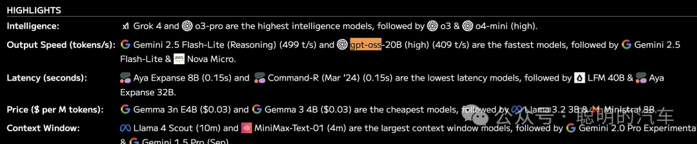
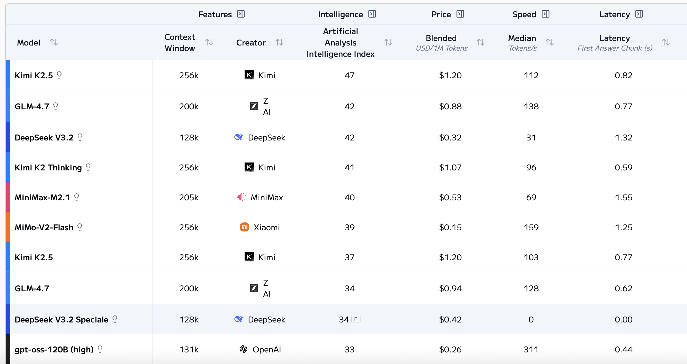
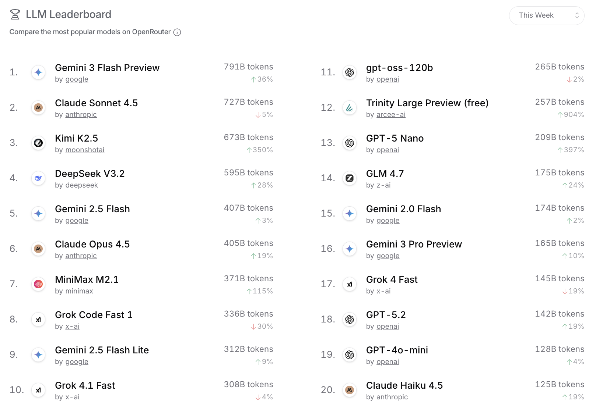
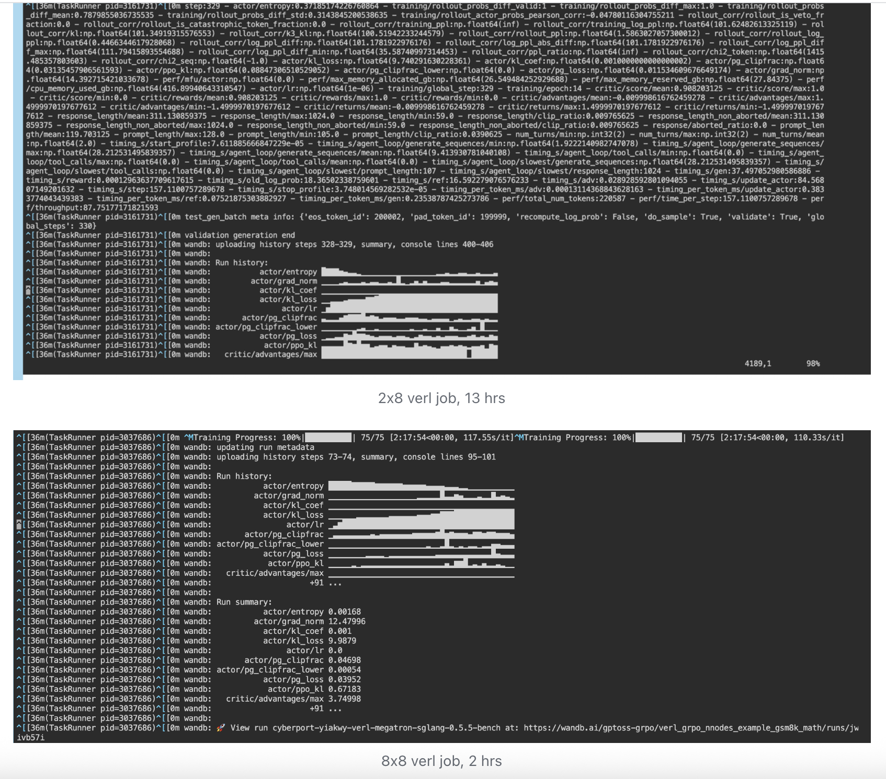
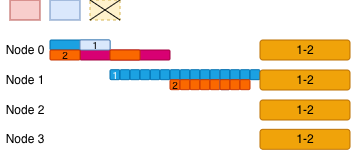
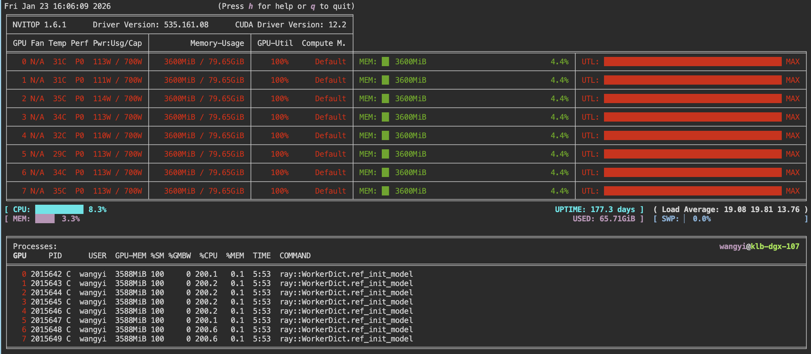
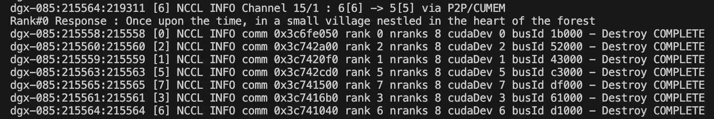
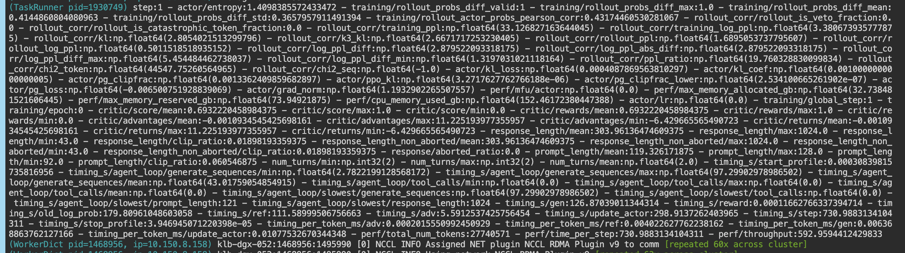
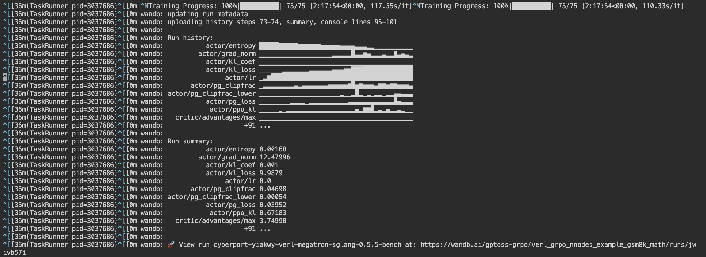

> RLHF in VeRL before 2025.12 requires colocated deployment [^1] [^3] of inference (actor ref rollout) and post training (actor in GRPO). In our experiments, large scale post training of GPTOSS [^2] with GRPO [^4] and `512` (64x8) GPU cards of `H800 DGX SupperPod`, demonstrated linear scaling of postraining of GPTOSS-20B over `64` (8x8) DGX SuperPod H800 cards at fixed float precision, reducing training job from `13` hrs (and upto 2 weeks to prepare) to `2` hrs, more than `500~598` toks/sec throughput, facilitating **`week-zero`** support. Training over `16x8` GPUs, it is necessary to separate nodes for inferences from those for training and `disable parameters offloading`. And these capabilities have been supported in the lastest VeRL as we extends the results in our proprietary `Slurm` post training platform. Besides, we also explored the possibility of using low bits and ultra low bits in the last year, and finally decided to use BF16 and FP8 as our main datatype of rollout system running inside our `Slurm` post training platform.

Authors : [LEI WANG](https://github.com/yiakwy-xpu-ml-framework-team) (yiakwang@ust.hk), Zhu Junqi (nickzhu@ust.hk), Guo Shengyao (guoshengyao@ust.hk), Pan Kunhao, Han Sirui (siruihan@ust.hk), Xue Wei (weixue@ust.hk)

## Contents

- [Why Choosing GPTOSS](#why-choosing-gptoss)
  + [GPTOSS Appetizers : Art of Balance of Performance, Affordability and Speed](#gptoss-appetizers--art-of-balance-of-performance-affordability-and-speed)
  + [Related Models](#related-models)
    * [Qwen3-next-coder](#qwen3-next-coder)
    * [Step-3_5-Flash](#step-3_5-flash)
- [Related Works](#related-works)
  + [Solution Bundle : VeRL, vLLM/SGLang, FSDP, Megatron-Core, Megatron-Bridge](#solution-boundle--verl--vllm--sglang--fsdp--megatron-core--megatron-bridge)
  + [GRPO over PPO](#grpo-over-ppo)
  + [Decouple Inference from Training](#decouple-inference-from-training)
  + [FP8 for Post Training in Hopper Platform](#low-bits-for-post-training-in-hopper-platform)
  + [Precision Verification](#verification)
- [Main Experiment](#training-method)
  + [Proprietary Slurm Post Training System](#multi-nodes-ray-system)
  + [Common Basic Config](#common-basic-config)
  + [Envrionmental Variables](#envrionmental-variables)
  + [Tunning Parameters](#tunning-parameters)
- [Conclusion](#conclusion)
- [Reference](#reference)
- [Sponsor Sources](#sponsor-sources)

## Why Choosing GPTOSS

#### GPTOSS Appetizers : Art of Balance of Performance, Affordability and Speed

Calling for light weight reasoning model with MoE architecture for making tool call decision in an agentic workflow, particularly with activated parameters of sizes ranging from 3B to 5B, have been roaring up since DeepSeek V3 and V3.1. Recorded in Aug 5 2025, GPTOSS 20B achieved (409 toks/sec) to be the most fast, yet agentic ready, model in Artifical Analysis Leaderboard[^5], and GPTOSS 120B is still the most fast, yet capable open source model as composing this article:

<br />

<figure>
<p align="center">

</p>
<figcaption style="text-align:center">GPTOSS 20b chieved the most fast model on Aug 6 2025</figcaption>
</figure>

<br />

<figure>
<p align="center">

</p>
<figcaption style="text-align:center">GPTOSS 120b keep the most fast open source model in 6 Feb 2026 since Aug 6 2025</figcaption>
</figure>

<br />

The performance of GPTOSS-120 has improved from 260.3 toks/sec to 311 toks/sec (average score) [^] and up to 906 toks/sec (via Together.ai API test), compared to the leader propiertary model Gemini 2.5 Flash-Lite (Sep) (613 t/s) and suppressing Gemini 2.5 Flash-Lite (Aug) (499/toks/sec) in open source models.

At the article is being composed, GPTOSS ranks the 4th most popular non-proprietary models according to openRouter [^6], following DeepSeek V3.2, MiniMax M2.1 and Kimi K2.5:

<br />

<figure>
<p align="center">

</p>
<figcaption style="text-align:center">GPTOSS 120b ranks the 4th most popular non-proprietary models </figcaption>
</figure>

<br />

We summarized that three key structural improvements [^5] [^7] making it the most favrourite appetizer for agentic workflow , hence being the agentic ready model :

- Incorporating YaRN Rotation [^8], this compact model extends the context to more than 100k length, covering all-scenario needs of agentic workflow;

- Supported an attention side project, similar to research in [^9] [^10], which involves adding `+1` to the softmax denominator. This enables the model to incorporate a learnable bias into the denominator of each attention head's softmax, allowing it to skip values at negative infinity [^9].

- This method employs a more aggressive `64:8` Grouped Query Attention (GQA) to improve the computational/memory access ratio.

We first SFT GPTOSS BF16 model with proprietary question and awser dataset and then quantize it to MXFP4 in `week-zero` support [^11]. And then we validated pass@k scores upon fact following dataset such as `SimpleQA` and HumanEval [^14] before proceeding post training of GPTOSS with SGLang and Megatron as backends [^12] [^13] :

<br/>

<div style="">
<table border="0" cellpadding="0" cellspacing="0" width="1026" style="border-collapse: collapse; width: 769pt; background-color: #ffffff; color: #000000;">
  <thead>
    <tr height="21" style="height: 16pt; background-color: #ffffff; color: #000000;">
      <th colspan="3" style="background-color: #ffffff; color: #000000; text-align: center; font-weight: bold; padding: 8px; border-bottom: 1px solid #000000;">
        GPT-OSS Code Generation Performance on SimpleQA Fact-Following Dataset
      </th>
    </tr>
    <tr height="21" style="height: 16pt; background-color: #ffffff; color: #000000;">
      <th style="background-color: #ffffff; color: #000000; border: 1px solid #000000; padding: 4px;">Metric</th>
      <th style="background-color: #ffffff; color: #000000; border: 1px solid #000000; padding: 4px;">Score</th>
      <th style="background-color: #ffffff; color: #000000; border: 1px solid #000000; padding: 4px;">RLHF Guidance & Insights *</th>
    </tr>
  </thead>
  <colgroup>
    <col width="113" style="width: 85pt;">
    <col width="87" style="width: 65pt;">
    <col width="132" style="width: 99pt;">
  </colgroup>
  <tbody>
    <tr height="21" style="height: 16pt; background-color: #ffffff; color: #000000;">
      <td align="center" style="padding: 4px; font-size: 12pt; font-family: 等线; vertical-align: middle; border: 1px solid #000000; text-wrap-mode: nowrap; background-color: #ffffff; color: #000000;"><strong>pass@1</strong></td>
      <td align="center" style="padding: 4px; font-size: 12pt; font-family: Calibri; vertical-align: middle; border: 1px solid #000000; text-wrap-mode: nowrap; background-color: #ffffff; color: #000000;">19.12%</td>
      <td align="left" style="padding: 4px; font-size: 11pt; font-family: Calibri; vertical-align: middle; border: 1px solid #000000; text-wrap-mode: nowrap; background-color: #ffffff; color: #000000;">
        <strong>Significance:</strong> Low single-attempt success rate indicates model struggles with precise specification implementation<br>
        <strong>RLHF Guidance:</strong> Need substantial improvement in instruction-following ability; focus on factual accuracy and specification adherence
      </td>
    </tr>
    <tr height="21" style="height: 16pt; background-color: #ffffff; color: #000000;">
      <td align="center" style="padding: 4px; font-size: 12pt; font-family: 等线; vertical-align: middle; border: 1px solid #000000; text-wrap-mode: nowrap; background-color: #ffffff; color: #000000;"><strong>pass@10</strong></td>
      <td align="center" style="padding: 4px; font-size: 12pt; font-family: Calibri; vertical-align: middle; border: 1px solid #000000; text-wrap-mode: nowrap; background-color: #ffffff; color: #000000;">35.60%</td>
      <td align="left" style="padding: 4px; font-size: 11pt; font-family: Calibri; vertical-align: middle; border: 1px solid #000000; text-wrap-mode: nowrap; background-color: #ffffff; color: #000000;">
        <strong>Significance:</strong> 10x sampling nearly doubles success rate, showing model generates diverse solutions<br>
        <strong>RLHF Guidance:</strong> Reward model should prioritize specification compliance over creative variations; current diversity helps exploration but needs refinement
      </td>
    </tr>
    <tr height="21" style="height: 16pt; background-color: #ffffff; color: #000000;">
      <td align="center" style="padding: 4px; font-size: 12pt; font-family: 等线; vertical-align: middle; border: 1px solid #000000; text-wrap-mode: nowrap; background-color: #ffffff; color: #000000;"><strong>pass@20</strong></td>
      <td align="center" style="padding: 4px; font-size: 12pt; font-family: Calibri; vertical-align: middle; border: 1px solid #000000; text-wrap-mode: nowrap; background-color: #ffffff; color: #000000;">39.30%</td>
      <td align="left" style="padding: 4px; font-size: 11pt; font-family: Calibri; vertical-align: middle; border: 1px solid #000000; text-wrap-mode: nowrap; background-color: #ffffff; color: #000000;">
        <strong>Significance:</strong> Marginal gains from 10 to 20 samples (only +3.7%) indicates diminishing returns<br>
        <strong>RLHF Guidance:</strong> Focus on quality over quantity; reward precision in early attempts rather than relying on extensive sampling
      </td>
    </tr>
    <tr height="21" style="height: 16pt; background-color: #ffffff; color: #000000;">
      <td align="center" style="padding: 4px; font-size: 12pt; font-family: 等线; vertical-align: middle; border: 1px solid #000000; text-wrap-mode: nowrap; background-color: #ffffff; color: #000000;"><strong>pass@50</strong></td>
      <td align="center" style="padding: 4px; font-size: 12pt; font-family: Calibri; vertical-align: middle; border: 1px solid #000000; text-wrap-mode: nowrap; background-color: #ffffff; color: #000000;">46.15%</td>
      <td align="left" style="padding: 4px; font-size: 11pt; font-family: Calibri; vertical-align: middle; border: 1px solid #000000; text-wrap-mode: nowrap; background-color: #ffffff; color: #000000;">
        <strong>Significance:</strong> 50 samples yield less than 50% success, highlighting fundamental limitations in fact-following<br>
        <strong>RLHF Conclusion:</strong> Model requires significant RLHF intervention focusing on: 1) Strict specification adherence, 2) Reduced ambiguity in interpretation, 3) Prioritization of correctness over creativity. Current performance supports RLHF necessity with clear improvement targets.
      </td>
    </tr>
  </tbody>
</table>
</div>

<br/>

MXFP4 is used as our main rollout and deployment datatype in a non-collocated post training system for better suppor from triton kernels with reference to `One Step Off Policy`. Later I will publish an article to elabrate how and why MXFP4/NFP4 work and derived a new datatype for MoE efficiency. As for collocated system based on VeRL, we scale the postraining system with SGLang/vLLM and Megatron backends after boostraping using FP8 rollout datatype and FSDP backend.

In our non-official experiments, we follow the tokenizer used by OpenAI GPTOSS and postrain the model mostly with English [^15], Candonese text-only datasets and evaluate mainly on MMLU Pro ,CMMLU and SWE-bench verified. Unlike `ModelSpec` used by OpenAI, our objectives of postraining expriemnt is specifically designed for decisions making such as tools calling, reasoning efforts deduction, user intention judging and context retrieving within agentic workflow.

#### Related Models

Though we postraining models over GPTOSS, there are plentfy of small and flash models designed sepecifically for **agentic workflow** catching up attentions recently. I would take this opportunity to remind you , it is not only about size, but also about objectives I mentioned above.

###### Qwen3-next-coder

Qwen3-Coder-Next is based on Qwen3-Next-80B-A3B-Base, and an open-weight language model engineered for coding agents and even longer context.

Previously GPTOSS 120b achieved `76.3%` in SWE-bench verified [^17] versus maximum (turning on multi-rounds search to gather contexts) of `74.8%`, demonstrating our choosing of GPTOSS-120b as appetizer model in text tasks. However, the objective of Qwen3-Coder-Next [^18] is emphasized on tool calling and `recovery from execution failures` makes it suitable for agentic workflow for coding and its usage of hybrid attention, aka `Gated DeltaNet` or `linear attention` and `Gated GQA`, extends context length significantly from 100K to 256K.

###### Step-3_5-Flash

Step-3_5_Flash activate 11 B parameters, almost double of that of GPT-120b-OSS, and achieved `74.4%` score in SWE-bench verfied [^19] slightly lower than GPT-OSS-120b as `Qwen3-next-coder`. As for Tau-bench dataset, Step-3_5_Flash performances (`88.2%`) [^19] significantly better than gptoss (67.8%).

Both `Step_3_5_Flash` and `Qwen3-Coder-next` employs hybrid attention modes to extend context. Instead of alternating between `Gated GQA` and linear attention, attention of each layer, alternates using of sliding windows [^19].

The objective `Step_3_5_Flash` is more general in agentic workflow than Qwen3-Coder-Next, making it more suitable for agentic tasks and a perfect example that the model which is better than GPTOSS, is also larger (double activation parameters) than GPTOSS, calling GPTOSS appetizer.

## Related Works

#### Solution Bundle : VeRL, vLLM/SGLang, FSDP, Megatron-Core, Megatron-Bridge。

GPTOSS has been quickly supported with `FSDP` and was recorded with `650 sec/step`, since `FSDP` is not a perfect choice for Expert Parallel. For example, we already enabled continuous training of GPTOSS over Megatron [^12] with protierary datasets and it facilitates of TP8 EP8 configuration for GPTOSS 20B with around `10` GB per GPU in a single node and more flexible partition schemes in multi-nodes continous training.

<br/>

The naive idea is that by ustilizing flexible partition schemes of Megatron, we can lower memory used per GPU during rollout and training, and finally disable parameters offloading in post training, which significantly redcues our efficiency of training.

<br/>

The initial estimation of `EP` (`EDP`) for GPTOSS-120b (32 experts) and GPTOSS-20b to be `4` and `3` respectively. With `PP` (`VPP`) we can further increase the throughput and finally reduced our training jobs from `13` hrs to `9` withtout throughput more than `596 toks/sec`. More details can be found in section of (`main experiment`)[#main-experiment].

<br />

<figure>
<p align="center">

</p>
<figcaption style="text-align:center">GPTOSS-20b post training over 64 cards example</figcaption>
</figure>

<br />

#### GRPO over PPO

In old days, with `PPO`, we packed \(chosen, rejected\) answer pair to a micro batch per GPU and implemented differentiable reward function for critical and reward models to score `lm_outputs` from `Megatron` at chosen or rejected positions:

<br />

The reward at each token is clipped surrogate objective function [^20] or a linear average of previous normalized reward, i.e. advantage (A).

<br/>


$$surrogate\ loss\ L\ at\ tok\ i = min(r_{\theta} * A, clip(r_{\theta}) * A)$$


<br/>

The sequence level score function is implemented by comparing the differences between positive answer and negative answer:

<br/>

```
Reward in reward training steps:

                   start_id
                   |
chosen   : * * * | A A A | p p   p p p S
rejected : * * * | B C A   E F | p p p S
                             |
                             end_id

* : prompt tok
p : pad tok
```

<br/>

The PPO score can be simply folumlated as

<br/>

```
loss = -logsigmoid ( SurrogatedScore (chosen) -  SurrogatedScore (rejected) ) * ChosenMASK /  valid_len

explantion :
- valid_len is the length starting from divergent position and ending before padding
- ChosenMask is the mask where tokens starts to begin different
- Surrogated Score function is a mapping from (b,s, n_embd) to (b, s) along sequence length
```

<br/>

This reduced the few days of `RLHF` job trained with MicroSoft `deepspeed-chat` in 2023 to the `9` hrs job with `Megatron` when the KV cache had not been not widely used in training and we used megatron `distributed fwd` for generation, largly limiting training performance.

<br/>

`GRPO` packs \(chosen, sampled answers : {R1, R2, ...}\) into a micro batch and brings even more simpler and quick reward function implementation [^21] [^22] without replicating itself with GPT backbones. Critic model is saved, and reward function is replaced with `better than average` target. The idea behind is that when we labeling data, it simetimes more easier to choose a preferred answer over sampled responses than explicitly choosing what we don't liek to see :

```
Chosen from dataset:

chosen : * * * | A B C | p   p p S

Sampled responses group (R1,R2...) by Actor to compute noramlized rewords after rollout completes:

                 compute normalized rewards at pos_id
                 |
R1:    : * * * | E F G | p   p p S
R2:    : * * * | A B E   I | p p S

* : prompt tok
p : pad tok
```

<br/>

Policy ratio in VeRL [^21] is formulated as :

```
# obtain the logits, i.e. the probability from old model and new model

# r_t(θ) = π_theta(a_t|s_t) / π_old(a_t|s_t) = exp(log_π_theta - log_π_old) as Bayesian multiplier
ppo_ratio = torch.exp(log_probs_theta - log_probs_old)  # [batch, seq_len]

# L^CLIP = - E_t [ min( w_t * r_t(θ) * A_t, w_t * clip(r_t(θ)) * A_t ) ]
surrogate1 = ppo_ratio * advantages

clipped_ratio = torch.clamp(ppo_ratio, 1.0 - clip_epsilon, 1.0 + clip_epsilon)  # [batch, seq_len]

surrogate2 = clipped_ratio * advantages  # [batch, seq_len]

losses = -torch.min(surrogate1, surrogate2)  # [batch, seq_len]

loss = losses.mean()
```

We follow this settings in VeRL to optimize our agentic workflow: labeling the favored answers, instructing LLM and enoding the outputs of the agentic workflow decisions at specific positions before calculating its per-token loss.

#### Decouple Inferences from Training

The current VeRL system, yet support non-collocated deployment recently [^3] [^23] [^24], was orignial desiged with limited resources, a lot of logics concentraing in parameters loading/offloading to fit GPU system memory. However, when we have more than `512` GPUs for post training, everything is different:

<br />

<figure>
<p align="center">

</p>
<figcaption style="text-align:center"> Our proposed multi-nodes post training system </figcaption>
</figure>

<br />

With `Megatron` as backend, by utilizing the flexible partition schemes : PP/TP/CP/ETP/EDP/SP, the per-device GPU memory can be as lower as `5` GB/GPU, and of course it is affordable to persist both rollout and training parameters without OOM:

<br />

<figure>
<p align="center">

</p>
<figcaption style="text-align:center"> Memory snapshot </figcaption>
</figure>

<br />

We have more than `1500` GB `CPU DRAM` memory per computing node, which is used for exchanging rollout and actor parameters with in-device safetensor formats.

<br />

As we scaling out from `1` node upto `16` nodes of H800 DGX SuperPod (total `128` GPU cards), the number of nodes for inference should be limited to `1` or `2` nodes since it is just enough to handle the large scale requesting [^25]. As for details how we scale, see the section of main experiment.

#### FP8 for Post Training in Hopper Platform

We quickly verified tensor-wise scale FP8 with FSDP [^26] in Hopper platform, before Megatron integration tests with SGLang/vLLM backends.

<br />

As for block-wise scale FP8, currently VeRL has supported flexible `quant_group_size`, which is good for GPTOSS 2880 intermediate size, however, neighter vllm and SGLang support `quant_group_size` of (64, 64) or (90, 90) with kernel block size (128, 128) at the time the article is composed [^27] [^28].

<br />

We didn't use other datatypes such as integer quantization of w4a16 for rollout, as integer quantization relies on complex smoothing functions and `shift` operation, which is extrememly expensive, to unpack data :

<br />

<figure>
<p align="center">

</p>
<figcaption style="text-align:center"> marlin (SGLang) benchmark </figcaption>
</figure>

<br />

#### Precision Verification

We support two modes of using Megatron. One can generate distribute checkpoint first and verify the correctness and then use huggingface model directly for massive post training experiments:

<br />

<figure>
<p align="center">

</p>
<figcaption style="text-align:center"> Megatron Distributed Fwd with KV Cache </figcaption>
</figure>

<br />

What is worthy of noted is that Megatron disributed fwd has supported KV Cache:

```python
import numpy as np
np.product = np.prod

import os

from argparse import ArgumentParser

from megatron.bridge import AutoBridge
from megatron.bridge.utils.common_utils import print_rank_0

try:
    from megatron.bridge.utils.common_utils import get_last_rank
except:
    def get_last_rank() -> int:
        """Get the last rank in the distributed group"""
        if not torch.distributed.is_initialized():
            return 0
        return torch.distributed.get_world_size() - 1

from megatron.bridge.training.model_load_save import load_megatron_model, save_megatron_model, load_tokenizer

from megatron.bridge.training.tokenizers.tokenizer import _HuggingFaceTokenizer

from megatron.core.pipeline_parallel.schedules import get_forward_backward_func

from megatron.core import parallel_state
from megatron.core import parallel_state as mpu
from megatron.core.tensor_parallel.random import model_parallel_cuda_manual_seed

from megatron.core.inference_params import InferenceParams
# from megatron.core.inference_context import InferenceContext

import torch
import torch.distributed as dist
from transformers import AutoModelForCausalLM, AutoTokenizer

from megatron.core.models.gpt.gpt_model import GPTModel

# load pretrain/SFT model info, only bf16 supported for the moment
MODEL="gpt-oss-20b-BF16"

# create soft links to /workspace/models
MODEL_DIR="/workspace/models"

HF_MODEL_DIR=f"{MODEL_DIR}/{MODEL}"

# Specify model partitions, we use parallel folding strategy to separate EP for MLP from pp-tp-cp-dp for Attention
TP=int(os.environ.get("TP", 8))
PP=int(os.environ.get("PP", 1))
CP=int(os.environ.get("CP", 1))

# Assume a single node setup in this script
EP=int(os.environ.get("EDP", 8 // PP)) # distributed evenly among all gpu cards
# ETP can only be 1 for GptOSS for the moment with Mcore backend
ETP=1

SAVER="mcore_bridge"

SEED=42

def init_distributed():
    """Initialize process group, model parallel, rng seed for single GPU."""
    os.environ["RANK"] = "0"
    os.environ["WORLD_SIZE"] = "1"
    os.environ["MASTER_ADDR"] = "localhost"
    os.environ["MASTER_PORT"] = "12355"

    if not torch.distributed.is_initialized():
        torch.distributed.init_process_group("nccl")
        torch.cuda.set_device(torch.distributed.get_rank())

    parallel_state.initialize_model_parallel(
        tensor_model_parallel_size=1,
        virtual_pipeline_model_parallel_size=None,
        context_parallel_size=1,
        expert_model_parallel_size=1,
    )
    model_parallel_cuda_manual_seed(42)


def enable_runtime_gather_output(module):
    """
    Recursively find GPTModel inside Megatron Bridge wrappers
    and enable runtime_gather_output for inference.
    """
    if hasattr(module, "runtime_gather_output"):
        module.runtime_gather_output = True

    # MegatronModule / DDP / pipeline wrappers
    if hasattr(module, "module"):
        enable_runtime_gather_output(module.module)

    if isinstance(module, GPTModel):
        module.config.runtime_gather_output = True

    # Handle lists / ModuleList
    if isinstance(module, (list, torch.nn.ModuleList)):
        for m in module:
            enable_runtime_gather_output(m)


# adpated from megatron bridge examples/
class SingleBatchIterator:
    """Iterator that yields a single batch of data for text generation.
    Required by the forward_backward_func function.

    This class creates an iterator that yields exactly one batch containing
    input tokens, position IDs, and attention mask, then raises StopIteration.
    Used for single-step inference in the forward pass.
    """

    def __init__(self, input_ids, position_ids, attention_mask):
        self.batch = dict(
            tokens=input_ids,
            position_ids=position_ids,
            attention_mask=attention_mask,
        )
        self._yielded = False

    def __iter__(self):
        return self

    def __next__(self):
        if self._yielded:
            raise StopIteration
        self._yielded = True
        return self.batch


def text_forward_step(data_iterator, model, inference_params=None, inference_context=None, **kwargs) -> torch.Tensor:
    """Forward step function for text generation.
    Required by the forward_backward_func function.

    Extracts a batch from the data iterator and runs the model forward pass
    with the provided input tokens, position IDs, and attention mask.

    Args:
        data_iterator: Iterator providing batches of input data
        model: The Megatron model to run forward pass on
        **kwargs: Additional keyword arguments (unused)

    Returns:
        Tuple of (model_output, loss_function)
    """
    batch = next(data_iterator)
    forward_args = {
        "input_ids": batch["tokens"],
        "position_ids": batch["position_ids"],
        "attention_mask": batch.get("attention_mask", None),
        "inference_params": inference_params,
        "runtime_gather_output": True,
        # "inference_context": inference_context,
    }

    def loss_func(x, **kwargs):
        return x

    return model(**forward_args), loss_func


def export(checkpoint=True):
    # gptoss bf16 recipe for post training
    dtype="bf16"

    # using Megatron Bridge provider API
    bridge = AutoBridge.from_hf_pretrained(HF_MODEL_DIR, trust_remote_code=True)

    provider = bridge.to_megatron_provider()

    provider.tensor_model_parallel_size = TP
    provider.pipeline_model_parallel_size = PP
    provider.context_parallel_size = CP

    # sparse model
    provider.expert_model_parallel_size = EP
    provider.expert_tensor_parallel_size = ETP

    provider.finalize()

    model = provider.provide_distributed_model(wrap_with_ddp=False)

    for m in model:
        # assert isinstance(m, GPTModel)
        enable_runtime_gather_output(m)

    # output info
    OUTPUT=f"{MODEL_DIR}/{MODEL}-to-{SAVER}-tp{TP}-pp{PP}-cp{CP}-ep{EP}-{dtype}"

    if not checkpoint:
        # to huggingface
        bridge.save_hf_pretrained(model, f"{OUTPUT}")
    else:
        # to megatron checkpoint
        save_megatron_model(model, f"{OUTPUT}", hf_tokenizer_path=f"{HF_MODEL_DIR}")
        OUTPUT = f"{OUTPUT}/iter_0000000"

    return model, OUTPUT


def _verify_tokenizer_and_hfmodel(hf_tokenizer, model):
    texts = ["Once upon the time",]
    messages = [
        {"role": "user", "content": text} for text in texts
    ]

    prompts = hf_tokenizer.apply_chat_template(
                messages,
                tokenize=False,
                add_generation_prompt=True)

    print("*******************************************")
    print(f"prompts : {prompts}, type : {type(prompts)}")
    print("*******************************************")

    # model_inputs = hf_tokenizer([prompts], return_tensors="pt").to(model.device)
    model_inputs = hf_tokenizer(texts, return_tensors="pt").to(model.device)

    outputs_ids = model.generate(**model_inputs, max_new_tokens=16)

    outputs_ids = [
        output_ids[len(input_ids):] for input_ids, output_ids in zip(model_inputs.input_ids, outputs_ids)
    ]

    response = hf_tokenizer.batch_decode(outputs_ids, skip_special_tokens=True)[0]
    print(f"[Rank#{0}] response : {response}")

def verify_tokenizer_and_hfmodel(hf_tokenizer_path, model):
    hf_tokenizer = AutoTokenizer.from_pretrained(hf_tokenizer_path)

    _verify_tokenizer_and_hfmodel(hf_tokenizer, model)

def verify_megatron_fwd(tokenizer_path, model, max_length=16):
    tokenizer = load_tokenizer(tokenizer_path)

    assert isinstance(tokenizer, _HuggingFaceTokenizer), "update script to adapt to mcore tokenizer (I am using legacy huggingface tokenizer)"

    model = [m.cuda() for m in model]
    for m in model:
        m.eval()

    prompt = "Once upon the time"
    token_ids = tokenizer.tokenize(prompt)

    inference_params = InferenceParams(
        max_sequence_length=max_length,
        max_batch_size=1,
    )

    with torch.no_grad():
        input_batch = torch.tensor([token_ids]).cuda()

        output_ids = input_batch.clone()

        fwd_bwd_function = get_forward_backward_func()

        inference_params.reset()

        for i in range(max_length - len(token_ids)):
            if i == 0:
                tokens = output_ids
            else:
                tokens = output_ids[:, -1:]

            position_ids = torch.arange(output_ids.size(1), device=tokens.device).unsqueeze(0)
            attention_mask = None # torch.ones_like(output_ids, dtype=torch.bool)

            data_iterator = SingleBatchIterator(tokens, position_ids, attention_mask)

            output = fwd_bwd_function(
                # forward_step_func=text_forward_step,
                forward_step_func=lambda data_iter, model: text_forward_step(
                    data_iter,
                    model,
                    inference_params=inference_params
                    # inference_context=inference_context
                ),
                data_iterator=data_iterator,
                model=model,
                num_microbatches=1,
                forward_only=True,
                # seq_length=tokens.size(1),
                seq_length=output_ids.size(1),
                micro_batch_size=1,
                collect_non_loss_data=True,
            )

            if isinstance(output, list) and len(output) > 0:
                output = output[0]

            if parallel_state.is_pipeline_last_stage():
                world_size = parallel_state.get_tensor_model_parallel_world_size()
                gathered_tensors = [torch.zeros_like(output) for _ in range(world_size)]

                dist.all_gather(gathered_tensors, output, group=parallel_state.get_tensor_model_parallel_group())

                logits = torch.cat(gathered_tensors, dim=2)

                next_token_id = torch.argmax(logits[:, -1, :], dim=-1).unsqueeze(-1)

                # DEBUG:
                token_text = tokenizer._tokenizer.decode(next_token_id[0].cpu().numpy())
                print_rank_0(f"Step#{i} : Last stage generated token: {next_token_id.item()} -> '{token_text}'")
            else:
                next_token_id = torch.ones((1, 1), device=output_ids.device, dtype=output_ids.dtype)

            torch.distributed.broadcast(next_token_id, src=get_last_rank())
            output_ids = torch.cat([output_ids, next_token_id], dim=1)

            if next_token_id.item() == tokenizer._tokenizer.eos_token_id:
                break

    response = tokenizer._tokenizer.decode(output_ids[0].cpu().numpy(), skip_special_tokens=True)
    print_rank_0(f"Rank#{torch.distributed.get_rank()} Response : {response}")


if __name__ == "__main__":
    parser = ArgumentParser()

    parser.add_argument(
        "--source_model", default=None, type=str, required=False, help="source model."
    )
    parser.add_argument(
        "--output_hf_dir", default=None, type=str, required=False, help="Where to save the converted model."
    )
    parser.add_argument(
        "--output_ckpt_dir", default=None, type=str, required=False, help="Where to save the converted model."
    )
    args = parser.parse_args()

    if args.source_model:
        MODEL_DIR = args.source_model
        HF_MODEL_DIR=f"{MODEL_DIR}/{MODEL}"

    if args.output_hf_dir:
        OUTPUT_DIR = args.output_hf_dir

        model = AutoModelForCausalLM.from_pretrained(OUTPUT_DIR,
                                                     torch_dtype="auto",
                                                     trust_remote_code=True)

        verify_tokenizer_and_hfmodel(OUTPUT_DIR, model)
    elif args.output_ckpt_dir:
        OUTPUT_DIR = f"{args.output_ckpt_dir}/iter_0000000"

        if not torch.distributed.is_initialized():
            init_distributed()

        model = load_megatron_model(OUTPUT_DIR)

        for m in model:
            enable_runtime_gather_output(m)

        verify_megatron_fwd(OUTPUT_DIR, model)

        if torch.distributed.is_initialized():
            torch.distributed.destroy_process_group()
    else:
        model, OUTPUT_DIR = export()

        verify_megatron_fwd(OUTPUT_DIR, model)

        if torch.distributed.is_initialized():
            torch.distributed.destroy_process_group()
```

## Main Experiment

#### Proprietary Slurm Post Training System

Our slurm system has 1 head node and 64 computing nodes. It does not alows direct ssh communication from head node to compute nodes and between compute nodes. Hence we need some special settings to make it work.

<br />

By default, MPI uses `SSH` to construct control plane. In this system, we use `pml` and `openmpi` with `Slurm` and `pml` support to make sure IP/TCP communication is used instead of `SSH` to build control plane:

```bash
...
# get node info
nodes=$(scontrol show hostnames "$SLURM_JOB_NODELIST")
nodes_list=($nodes)

head_node=${nodes_list[0]}
head_node_ip=$(srun --nodes=1 --ntasks=1 -w "$head_node" hostname --ip-address)

# export master address for FSDP/NCCL
export MASTER_ADDR=$head_node_ip
export MASTER_PORT=6500
...

# create image
echo "create container ..."
srun --jobid $SLURM_JOB_ID --ntasks=$SLURM_NNODES --ntasks-per-node=1 --cpus-per-task=1 /bin/bash -c "

# ls -lh /dev/shm/
echo \"visting \$(hostname)\"

if ! enroot list | grep -q '^$CONTAINER_NAME\$'; then
        echo \"[ \$(hostname) ] Container '$CONTAINER_NAME' not found. Creating...\"
        ENROOT_MAX_PROCESSORS=128 enroot create --name $CONTAINER_NAME $IMG
else
        echo \"[ \$(hostname) ] Container '$CONTAINER_NAME' already exists.\"
fi
"
...

echo "JOB#${SLURM_JOB_ID} start into the container ..."

# export SLURM_CONTAINER_SHM_SIZE=16g
export SLURM_CONTAINER_IPC_HOST=1

srun --mpi=pmix \
     --export=ALL \
     --container-name=$CONTAINER_NAME \
     --container-image=/cm/shared/containers/ngc/py312-torch2.8cu128-te2.9-triton3.4-sglang-0.5.5-vllm-0.11-1208+latest.sqsh \
     --mem=32G \
     --container-mounts="$MOUNTS" \
     bash /home/users/$USER/verl_nx8_exec_jobs.sh

echo "=== job finished ==="
echo "Done: $(date)"
```

<br />

After verifiction simple all reduction functions well, we use `Ray` for multinodes training :

```bash
export MASTER_ADDR=${MASTER_ADDR:-$this_addr}
export MASTER_PORT=${MASTER_PORT}

export RANK=${RANK:-0}

echo "[ray script] [Rank#${RANK}] MASTER_ADDR : $MASTER_ADDR"
echo "[ray script] [Rank#${RANK}] MASTER_PORT : $MASTER_PORT"

export RAY_DISABLE_AUTH=1

export NNODES=${NNODES:-2}

export WORLD_SIZE=${WORLD_SIZE:-16}

echo "[ray script] [Rank#${RANK}] hostname `hostname` rank = $RANK"

export TMPDIR_local="/root/tmp/ray_rlhf_jobs/n_nodes"
export TMPDIR_2="/root/dev/shm/ray_rlhf_jobs/n_nodes"

export TMPDIR=$TMPDIR_local

which ray
ray stop -f

sleep 3

ls -lh $TMPDIR_local
ls -lh $TMPDIR_2

rm -rf $TMPDIR_local
mkdir -p $TMPDIR_local

rm -rf $TMPDIR_2
mkdir -p $TMPDIR_2

export TRITON_CACHE_DIR=$TMPDIR_2/triton_cache
export TORCHINDUCTOR_CACHE_DIR=$TMPDIR_2/torchinductor

mkdir -p $TRITON_CACHE_DIR
mkdir -p $TORCHINDUCTOR_CACHE_DIR

echo "login wandb..."
wandb login $WANDB_API_KEY

auth_opt=" \
"

if [ "$RANK" -eq "0" ]; then
    export RAY_TMPDIR=$TMPDIR_local
    echo "[ray script] [Rank#${RANK}] start head node at `hostname` rank = $RANK ..."
    ps aux | grep ray | grep $MASTER_PORT &> /dev/null || \
    ray start --head --node-ip-address=$MASTER_ADDR --disable-usage-stats \
        --port=$MASTER_PORT \
	      $auth_opt \
	      --temp-dir=$TMPDIR \
	      --num-gpus=8 \
        --block &

    # Wait for all worker nodes to join the cluster.
    echo "[ray script] [Rank#${RANK}] head node at `hostname` rank = $RANK is waiting for peer nodes to join in..."
    sleep 10 2>&1 | tee logs/test_rank_${RANK}.log

    ray status

    export RAY_ADDRESS=$MASTER_ADDR:$MASTER_PORT

    echo "[ray script] [Rank#${RANK}] Executing training script on head node..."
    bash run_gpt_20b_vllm_megatron.sh.bench

    echo "[ray script] [Rank#${RANK}] Closing ..."
    ray stop
else
    echo "[ray script] [Rank#${RANK}] wait Head node to start at `hostname` rank = $RANK ..."

    sleep 3

    echo "[ray script] [Rank#${RANK}] start Ray Worker node at `hostname` rank = $RANK ..."

    ip=$(hostname -i)
    ps aux | grep ray | grep $MASTER_ADDR:$MASTER_PORT &> /dev/null || ray start --address $MASTER_ADDR:$MASTER_PORT --node-ip-address=$ip --disable-usage-stats --block

    WORKER_PID=$!

    echo "[ray script] [Rank#${RANK}] waiting for task to complete (wid=$WORKER_PID) ..."
    wait $WORKER_PID

    echo "[ray script] [Rank#${RANK}] Closing ..."
    ray stop
fi
```

<br />

<figure>
<p align="center">

</p>
<figcaption style="text-align:center"> Submitting 8x8 slurm jobs </figcaption>
</figure>

<br />


#### Common Basic Config

```
# data
DATA="
    data.train_files='$blender_train_dataset_path' \
    data.val_files='$blender__test_dataset_path' \
    data.train_batch_size=${train_batch_size} \
    data.max_prompt_length=${max_prompt_length} \
    data.max_response_length=${max_response_length} \
    data.filter_overlong_prompts=True \
    data.prompt_key=prompt \
    data.return_raw_chat=$return_raw_chat \
    data.truncation='left' \
    +data.apply_chat_template_kwargs.reasoning_effort=medium \
"

# Actor common
ACTOR_GRAD_PARAM_OFFLOAD="
    actor_rollout_ref.actor.megatron.grad_offload=$offload \
"

ACTOR_PARAM_OFFLOAD="
    actor_rollout_ref.actor.megatron.param_offload=$offload \
    actor_rollout_ref.actor.megatron.optimizer_offload=$offload \
    $ACTOR_GRAD_PARAM_OFFLOAD \
"

ACTOR_REF_PARAM_OFFLOAD="
    actor_rollout_ref.ref.megatron.param_offload=$ref_cpu_offload \
"

ACTOR_PARALLEL="
    actor_rollout_ref.actor.megatron.use_mbridge=True \
    actor_rollout_ref.actor.megatron.vanilla_mbridge=False \
    actor_rollout_ref.actor.megatron.pipeline_model_parallel_size=$PP \
    actor_rollout_ref.actor.megatron.tensor_model_parallel_size=$TP \
    actor_rollout_ref.actor.megatron.expert_model_parallel_size=$EP \
    actor_rollout_ref.actor.megatron.expert_tensor_parallel_size=$ETP \
    actor_rollout_ref.actor.megatron.sequence_parallel=$SP \
"


ACTOR_REF_PARALLEL="
    actor_rollout_ref.ref.megatron.pipeline_model_parallel_size=$PP \
    actor_rollout_ref.ref.megatron.tensor_model_parallel_size=$TP \
    actor_rollout_ref.ref.megatron.expert_model_parallel_size=$EP \
    actor_rollout_ref.ref.megatron.expert_tensor_parallel_size=$ETP \
    actor_rollout_ref.ref.megatron.sequence_parallel=$SP \
"

# actor_rollout_ref.actor.entropy_checkpointing=True \
ACTOR="
    actor_rollout_ref.actor.use_kl_loss=$use_kl_loss \
    actor_rollout_ref.actor.kl_loss_coef=0.001 \
    actor_rollout_ref.actor.clip_ratio_low=$clip_ratio_low \
    actor_rollout_ref.actor.clip_ratio_high=${clip_ratio_high} \
    actor_rollout_ref.actor.clip_ratio_c=10.0 \
    actor_rollout_ref.actor.optim.lr=1e-6 \
    actor_rollout_ref.actor.optim.lr_warmup_steps=3 \
    actor_rollout_ref.actor.optim.weight_decay=0.1 \
    actor_rollout_ref.actor.optim.clip_grad=1.0 \
    ${ACTOR_PARAM_OFFLOAD} \
    ${ACTOR_REF_PARAM_OFFLOAD} \
    ${ACTOR_PARALLEL} \
    ${ACTOR_REF_PARALLEL} \
    actor_rollout_ref.model.use_remove_padding=False \
    actor_rollout_ref.actor.kl_loss_type=low_var_kl \
    actor_rollout_ref.actor.entropy_coeff=0 \
    actor_rollout_ref.actor.loss_agg_mode=\"token-mean\" \
    actor_rollout_ref.actor.ppo_mini_batch_size=${ppo_mini_batch_size} \
    actor_rollout_ref.actor.ppo_micro_batch_size_per_gpu=${ppo_micro_batch_size_per_gpu} \
    actor_rollout_ref.actor.use_dynamic_bsz=$use_dynamic_bsz \
    actor_rollout_ref.actor.ppo_max_token_len_per_gpu=${actor_ppo_max_token_len} \
"
```

Since we are using Megatron as backend, some functions such recompute, kernels with communication overllap is immedaitely into use :

```
# Actor - Megatron backend
MEGATRON_OPT="
    actor_rollout_ref.actor.megatron.override_transformer_config.attention_backend=auto \
    +actor_rollout_ref.actor.megatron.override_transformer_config.apply_rope_fusion=True \
"

ACTOR_OPTIM_OPT="
    +actor_rollout_ref.actor.optim.override_optimizer_config.optimizer_offload_fraction=1 \
    +actor_rollout_ref.actor.optim.override_optimizer_config.overlap_cpu_optimizer_d2h_h2d=True \
    +actor_rollout_ref.actor.optim.override_optimizer_config.use_precision_aware_optimizer=True \
    +actor_rollout_ref.actor.optim.override_optimizer_config.optimizer_cpu_offload=$actor_opt_cpu_offload \
"

MAGATRON_MEM_OPT="
    actor_rollout_ref.model.use_fused_kernels=False \
    +actor_rollout_ref.actor.megatron.override_transformer_config.recompute_method=uniform \
    +actor_rollout_ref.actor.megatron.override_transformer_config.recompute_granularity=full \
    +actor_rollout_ref.actor.megatron.override_transformer_config.recompute_num_layers=1
    $MEGATRON_OPT \
    $ACTOR_OPTIM_OPT \
"
```

Rollout before 2025.12 has configuration of :

```
ROLLOUT=(
    actor_rollout_ref.rollout.name=$rollout_name
    actor_rollout_ref.rollout.mode=$rollout_mode
    actor_rollout_ref.rollout.dtype=${rollout_dtype}
    actor_rollout_ref.rollout.gpu_memory_utilization=$memory_usage_rage
    actor_rollout_ref.rollout.tensor_model_parallel_size=$gptoss_rollout_tp_size
    actor_rollout_ref.rollout.enable_chunked_prefill=True
    actor_rollout_ref.rollout.max_num_batched_tokens=$((max_prompt_length + max_response_length))
    actor_rollout_ref.rollout.temperature=${temperature}
    actor_rollout_ref.rollout.top_p=1.0
    actor_rollout_ref.rollout.top_k=-1
    actor_rollout_ref.rollout.val_kwargs.temperature=${temperature}
    actor_rollout_ref.rollout.val_kwargs.top_p=${val_top_p}
    actor_rollout_ref.rollout.val_kwargs.top_k=${top_k}
    actor_rollout_ref.rollout.val_kwargs.do_sample=True
    actor_rollout_ref.rollout.val_kwargs.n=1
    actor_rollout_ref.rollout.calculate_log_probs=True
    actor_rollout_ref.rollout.n=${n_resp_per_prompt}
    actor_rollout_ref.rollout.log_prob_micro_batch_size_per_gpu=$micro_batch_size_per_gpu
    actor_rollout_ref.rollout.log_prob_use_dynamic_bsz=$use_dynamic_bsz
    actor_rollout_ref.rollout.log_prob_max_token_len_per_gpu=${infer_ppo_max_token_len}
    actor_rollout_ref.rollout.enforce_eager=$ROLLOUT_EAGER
    actor_rollout_ref.rollout.free_cache_engine=$ROLLOUT_FREE_CACHE
)

ROLLOUT_REF="
    actor_rollout_ref.ref.log_prob_micro_batch_size_per_gpu=$micro_batch_size_per_gpu \
    actor_rollout_ref.ref.log_prob_use_dynamic_bsz=$use_dynamic_bsz \
    actor_rollout_ref.ref.log_prob_max_token_len_per_gpu=${infer_ppo_max_token_len} \
"
```

We added some new paramters after 2026.1 to faciliate one step off policy training cross massive nodes more efficiently:

```bash
ROLLOUT=(
...
    actor_rollout_ref.rollout.quantization=${quant_dtype}
    actor_rollout_ref.rollout.expert_parallel_size=$gptoss_rollout_tp_size
    actor_rollout_ref.rollout.nnodes=1
    actor_rollout_ref.rollout.n_gpus_per_node=4
...
)
```

Combining them together. Before 2025.12, we use in head node:

```bash
HYDRA_FULL_ERROR=1 python3 -m verl.trainer.main_ppo \
    --config-path=config \
    --config-name='ppo_megatron_trainer.yaml' \
    algorithm.adv_estimator=grpo \
    algorithm.use_kl_in_reward=False \
    algorithm.kl_ctrl.kl_coef=0.0 \
    actor_rollout_ref.model.path="${HF_MODEL_PATH}" \
    $DATA \
    "${ROLLOUT[@]}" \
    $ROLLOUT_REF \
    $ACTOR \
    $MAGATRON_MEM_OPT \
    trainer.critic_warmup=0 \
    trainer.logger='["console","wandb"]' \
    trainer.project_name='verl_grpo_nnodes_example_gsm8k_math' \
    trainer.experiment_name='yiakwy-verl-megatron-vllm-0.5.5-bench' \
    trainer.n_gpus_per_node=8 \
    trainer.nnodes=$NNODES \
    trainer.val_before_train=False \
    trainer.test_freq=10 \
    trainer.save_freq=-1 \
    trainer.default_local_dir=$CKPT_DIR \
    trainer.resume_mode=auto \
    trainer.total_epochs=15 $@  2>&1 | tee logs/verl_megatron_rank_$(hostname)_${RANK}.log

```

After 2026.1, we suggest `one step off policy` asynchronous main ppo loop as starter :

```bash
...
HYDRA_FULL_ERROR=1 python3 -m verl.experimental.one_step_off_policy.async_main_ppo \
...
```

#### Envrionmental Variables

Not too much , but just pay attention to the size of `RAY_TMPDIR`.

#### Tunning Parameters

Tuning parameters is straight forward, we setup rollout parallel and identified `TP4` without `data parallel attention` is most suitable [^29] [^30]:

<br />

<figure>
<p align="center">

</p>
<figcaption style="text-align:center"> GPTOSS TP, GQA DP ATTN PARALLEL TEST [^30] </figcaption>
</figure>

<br />

Then we proceed to megatron optimzation.

Since we are using `H800 SuperPOD`, we would like to recompute to facilite computing time for IO cost. This should also work for `GB300 SuperPOD` where 1000 TFLOPS achieved and exposes a very steep compute intensity ratio in roofline model, we will verify this concept in a near future.

Based on our empirical experienceds prefer to try PP (VPP) first, then distribute experts evenly to all the cards available. For example if we have 4 nodes, we can distribute experts to maximum 16 GPU cards if PP = 2 and maximum of 32 cards if PP = 1.

<br/>

<p>
<figcaption style="text-align:center"> Post training warm up </figcaption>
</p>
| NNodes | TP(ROLL_OUT) | TP | EP | PP | CP | BS | MBS (rollout) | Seq (max_response_length) | Rollout backend | Training backend | offload (actor\ref) | Throughput (tokens/sec) | Sec / iter (s/it) |
| :--- | :--- | :--- | :--- | :--- | :--- | :--- | :--- | :--- | :--- | :--- | :--- | :--- | :--- |
| 1 | 8 | 8 | 8 | 1 | 1 | 64 | 4 | 1024 | vllm | Megatron | TRUE | 60 | 160 |
| 2 | 8 | 8 | 8 | 2 | 1 | 128 | 4 | 1024 | vllm | Megatron | TRUE | 86.68 | 145.86 |
| 2 | 4 | 8 | 8 | 2 | 1 | 128 | 4 | 1024 | vllm | Megatron | TRUE | 84.14 | 148.34 |
| 2 | 8 | 8 | 8 | 2 | 1 | 128 | 8 | 1024 | vllm | Megatron | TRUE | 118 | 429.75 |
| 2 | 4 | 8 | 8 | 2 | 1 | 128 | 32 | 1024 | vllm | Megatron | TRUE | 118.69 | 777.22 |

<br/>

Fully turning off parameters offloading is not trival. After scaling to 4 nodes, we finnaly get stable training with significant performance improvement :

<br/>
<p>
<figcaption style="text-align:center"> Main experiment snapshot </figcaption>
</p>
| NNodes | TP(ROLL_OUT) | TP | EP | PP | CP | BS | MBS (rollout) | Seq (max_response_length) | Rollout backend | Training backend | offload (actor\ref) | Throughput (tokens/sec) | Sec / iter (s/it) | Note |
| :--- | :--- | :--- | :--- | :--- | :--- | :--- | :--- | :--- | :--- | :--- | :--- | :--- | :--- | :--- |
| 4 | 4 | 4 | 8 | 2 | 1 | 256 | 8 | 1024 | vllm | Megatron | TRUE | 104.79 | 128.36 | 5% |
| 4 | 4 | 4 | 8 | 2 | 1 | 256 | 8 | 1024 | vllm | Megatron | FALSE | 282.1 | 220.41 | OOM |
| 4 | 4 | 2 | 16 | 4 | 1 | 256 | 8 | 1024 | vllm | Megatron | FALSE | 290.775 | 194.1 | 50% |
| 4 | 4 | 2 | 8 | 4 | 1 | 256 | 8 | 1024 | vllm | Megatron | FALSE | 432.46 | 123.51 | 57% |
| 8 | 4 | 2 | 8 | 4 | 1 | 512 | 8 | 1024 | vllm | Megatron | FALSE | 403.19 | 144.45 | - |
| 8 | 4 | 1 | 16 | 4 | 1 | 512 | 8 | 1024 | vllm | Megatron | FALSE | 489 | 129.97 | 47% |
| 8 | 4 | 1 | 16 | 4 | 1 | 512 | 8 | 1024 | vllm | Megatron | FALSE | 512.71 | 108.62 | 78.80% |

<br/>

By tuning over several paremters we got maximum throughput of 598 toks/sec and reduce training jobs from `13` hrs to `2` hrs:

<br />

<figure>
<p align="center">

</p>
<figcaption style="text-align:center"> Training Tput Snapshot </figcaption>
</figure>

<br />

<figure>
<p align="center">

</p>
<figcaption style="text-align:center"> 2 Hrs Training at fixed CP (1) </figcaption>
</figure>

<br />

## Conclusion

We verfied linearing scaling capability of Post Trianing from tiny scale to middle scale when parameters offloading fully disabled and decoupling inference from training is secured, reducing a `13` training jobs to `2` hrs.

This fully open up the possibilities of `week-zero` support post training when more and more open source models are released.

## Reference

[^1] One Step Off Policy : https://github.com/verl-project/verl/tree/main/verl/experimental/one_step_off_policy. Retrieved on 5 Feb 2026.

[^2] Introducing GPTOSS : https://openai.com/index/introducing-gpt-oss/, OpenAI. Retrieved on 6 Feb 2026.

[^3] AReaL: A Large-Scale Asynchronous Reinforcement Learning System for Language Reasoning, Wei Fu and Jiaxuan Gao and Xujie Shen and Chen Zhu and Zhiyu Mei and Chuyi He and Shusheng Xu and Guo Wei and Jun Mei and Jiashu Wang and Tongkai Yang and Binhang Yuan and Yi Wu, 2025, https://arxiv.org/abs/2505.24298. Retrieved on 6 Feb 2026.

[^4] GRPO verl implementation : https://verl.readthedocs.io/en/latest/algo/grpo.html. Retrieved on 5 Feb 2026.

[^5] On The Heels of The Release of GPT OSS MXFP4, yiakwy, https://mp.weixin.qq.com/s/OxY4YxR1EGobPBAXJ4By2A. Published on Aug 6 2025

[^6] https://artificialanalysis.ai/models/gpt-oss-120b/providers. Retrieved on 6 Feb 2026.

[^7] https://openrouter.ai/rankings. Retrieved on 6 Feb 2026.

[^8] B. Peng, J. Quesnelle, H. Fan, and E. Shippole, “YaRN: Efficient context window extension of large language models,” arXiv preprint arXiv:2309.00071, 2023

[^9] E. Miller, “Attention is off by one (2023),” URL https://www.evanmiller.org/attention-is-offby-one.html.

[^10] G. Xiao, Y. Tian, B. Chen, S. Han, and M. Lewis, “Efficient streaming language models with attention sinks,” arXiv preprint arXiv:2309.17453, 2023.

[^11] GPTOSS 120B BF16 SFT : https://github.com/openai/gpt-oss/pull/108

[^12] https://github.com/NVIDIA/Megatron-LM/pull/2383

[^13] Support of GPTOSS training over vllm and sglang backends : https://github.com/verl-project/verl/pull/4394, https://github.com/verl-project/verl/pull/4323

[^14] gpt-oss-20b Pass@k score private reserach : https://medium.com/@ggfincke/how-pass-k-is-used-to-evaluate-llm-coding-performance-296e5c4565bc

[^15] NVIDIA MIX : https://huggingface.co/datasets/nvidia/Nemotron-ClimbMix

[^16] Qwen3-Coder-Next : https://qwen.ai/blog?id=qwen3-coder-next.Retrieved on 6 Feb 2026.

[^17] SWEbench score for GPTOSS-120b : https://z.ai/blog/glm-4.7. Retrieved on 6 Feb 2026.

[^18] Qwen Team, “Qwen3-Coder-Next Technical Report (2026),” URL https://github.com/QwenLM/Qwen3-Coder/blob/main/qwen3_coder_next_tech_report.pdf. Retrieved on 6 Feb 2026

[^19] Step-3.5-Flash : https://static.stepfun.com/blog/step-3.5-flash/. Retrieved on 6 Feb 2026.

[^20] Schulman, J., Wolski, F., Dhariwal, P., Radford, A., & Klimov, O. (2017). Proximal Policy Optimization Algorithms. arXiv:1707.06347

[^21] GRPO explaination : https://abderrahmanskiredj.github.io/the-illustrated-grpo/. Retrieved on 6 Feb 2026.

[^22] GRPO math in VeRL : https://verl.readthedocs.io/en/latest/algo/rollout_corr_math.html. Retrieved on 6 Feb 2026.

[^23] One Step Off Policy Async Trainer : https://github.com/verl-project/verl/tree/main/verl/experimental/one_step_off_policy. Retrieved on 6 Feb 2026.

[^24] Megatron RL : https://github.com/NVIDIA-NeMo/RL/discussions/1161. Retrieved on 6 Feb 2026.

[^25] Comprehensive Study of H800x104 DGX SuperPod Disaggregation Strategy in SGLang v0.4.8, https://huggingface.co/blog/yiakwy-xpu-team/h800x104-disagg-serving-on-sglang

[^26] FP8 Support in VeRL : https://github.com/verl-project/verl/issues/4641, Retrieved on 6 Feb 2026.

[^27] verl support block-wise fp8 scale : https://github.com/verl-project/verl/blame/06449b8bb9f1896d58f8e3f5739a55bb72005166/verl/utils/vllm/vllm_fp8_utils.py#L118, https://github.com/verl-project/verl/commit/597b63faef07b4a819356ef497c0e29e4fd86226

[^28] vllm fused moe triton kerenel uses quant_block_size as kernel block size : https://github.com/vllm-project/vllm/blob/ab10d798555ee3611f82e71cbe573086fb92a4ed/vllm/model_executor/layers/fused_moe/fused_moe.py#L1558. Retrieved on 6 Feb 2026.

[^29] DP attention explainatin : https://github.com/sgl-project/sglang/pull/18096#issuecomment-3838610683. Retrieved on 6 Feb 2026.

[^30] Fix DP attention : https://github.com/sgl-project/sglang/pull/9308

[*] AI Suggestion from ChatGPT, we seek suggestion from AI and record it honestly; GPTOSS-120b without our SFT only achieves 13% in SimpleQA dataset

## Sponsor Sources
[Huggingface](https://huggingface.co/blog/yiakwy-xpu-team/h800x104-disagg-serving-on-sglang)
